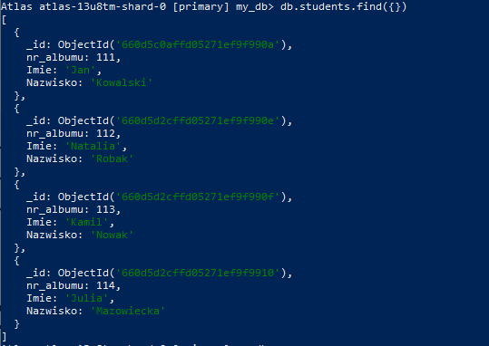
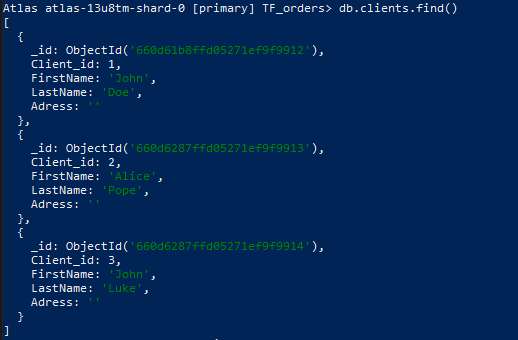
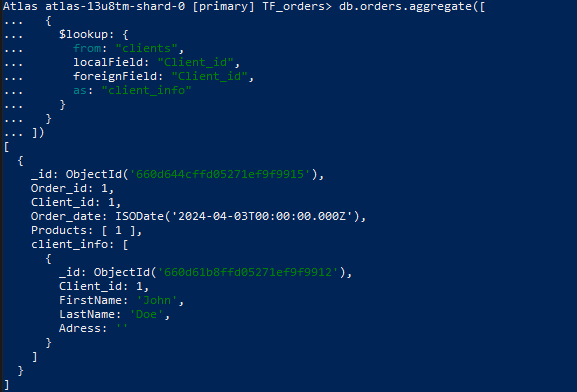
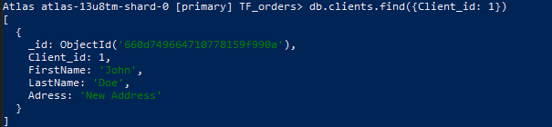
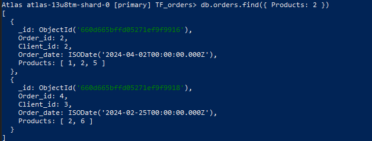
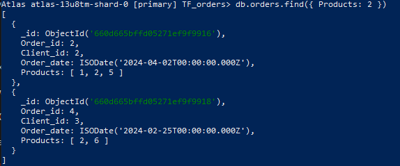
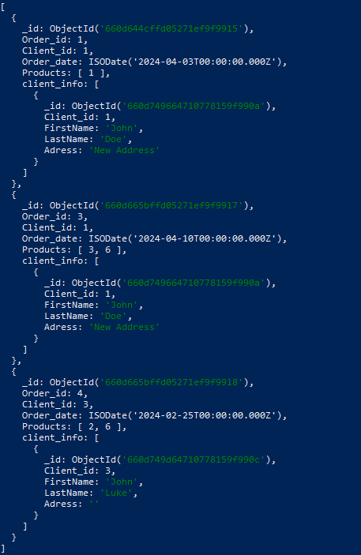
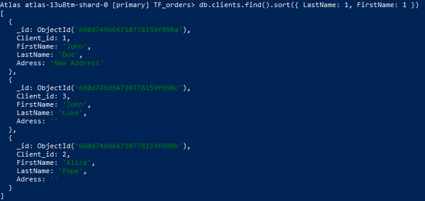

# Dokumentowe bazy danych – MongoDB

ćwiczenie 1


---

**Imiona i nazwiska autorów:** Tomasz Furgała, Łukasz Zegar, Konrad Tendaj

--- 

# Zadanie 1 - połączenie z serwerem bazy danych

Połącz się serwerem MongoDB

Można skorzystać z własnego/lokanego serwera MongoDB
Można stworzyć własny klaster/bazę danych w serwisie MongoDB Atlas
- [https://www.mongodb.com/atlas/database](https://www.mongodb.com/atlas/database)

Połącz za pomocą konsoli mongsh

Ewentualnie zdefiniuj połączenie w wybranym przez siebie narzędziu

Stwórz bazę danych/kolekcję/dokument
- może to być dowolna kolekcja, dowolny dokument – o dowolnej strukturze, chodzi o przetestowanie działania połączenia


---

## Zadanie 1  - rozwiązanie

Tworzymy serwer w mongoDB Atlas

W konsoli z zainstalowanym mongosh wpisujemy:  
`mongosh "mongodb+srv://cluster1.oj7zkbt.mongodb.net/" --apiVersion 1 --username <nasza_nazwa>`

Podajemy hasło: `<nasze_hąsło>`

Z danymi użytkownika utworzonemu w bazie Atlas.

Korzystamy z `use my_db`, które utworzy nam bazę danych jeżeli taka nie istnieje.

Dodajemy dane:  
```js
db.students.insertOne({nr_albumu: 111, Imie: "Jan", Nazwisko: "Kowalski"})

db.students.insertMany([  
 {nr_albumu: 112, Imie: "Natalia", Nazwisko: "Robak"},   
 {nr_albumu: 113, Imie: "Kamil", Nazwisko: "Nowak"},  
 {nr_albumu: 114, Imie: "Julia", Nazwisko: "Mazowiecka"}  
]);
```

---


# Zadanie 2 - przykładowe zbiory danych

Zaimportuj przykładowe zbiory danych

MongoDB Atlas Sample Dataset
- [https://docs.atlas.mongodb.com/sample-data](https://docs.atlas.mongodb.com/sample-data)
- w przypadku importu z lokalnych plików można wykorzystać polecenie `mongorestore`
	- [https://www.mongodb.com/docs/database-tools/mongorestore/](https://www.mongodb.com/docs/database-tools/mongorestore/)

```
mongorestore <data-dump-folder>
```

np.  

```
mongorestore samples
```

- Oczywiście, w przypadku łączenia się zdalnym serwerem należy podać parametry połączenia oraz dane logowania

Yelp Dataset

- wykorzystaj komendę `mongoimport`
- [https://www.mongodb.com/docs/database-tools/mongoimport](https://www.mongodb.com/docs/database-tools/mongoimport)

```
mongoimport --db <db-name> --collection <coll-name> --type json --file <file>
```


np.

```
mongoimport --db yelp --collection business --type json --file ./yelp_academic_dataset_business.json
```

- można też wykorzystać np.  narzędzie MongoDB Compass


Zapoznaj się ze strukturą przykładowych zbiorów danych/kolekcji
- W bazach danych: MongoDB Atlas Sample Dataset
	- Skomentuj struktury użyte w dokumentach dla dwóch wybranych zbiorów (takich które wydają ci się najciekawsze)
	- np. Sample Analitics Dataset i Sampe Traning Dataset

- W bazie Yelp
	- Skomentuj struktury użyte w dokumentach bazy Yelp

Przetestuj działanie operacji
- `mongodump`
	- [https://www.mongodb.com/docs/database-tools/mongodump/](https://www.mongodb.com/docs/database-tools/mongodump/)
- `mongoexport`
	- [https://www.mongodb.com/docs/database-tools/mongoexport/](https://www.mongodb.com/docs/database-tools/mongoexport/)

---

## Zadanie 2  - rozwiązanie

> Wyniki: 
>
>Analiza bazy sample_mflix z atlas samples


- W bazie mflix istnieją powiązania między różnymi kolekcjami. Na przykład, recenzja jest powiązana z filmem poprzez identyfikator filmu.

- poniżej wyświetlony fragment kolekcji movies

```js
use sample_mflix
db.movies.find()
```


- Kolekcja ta zawiera dokumenty reprezentujące pojedyncze filmy. Każdy dokument zawiera różne pola opisujące film, takie jak tytuł, rok produkcji, gatunek, lista obsady, reżyser itp.


---

# Zadanie 3 - operacje CRUD, operacje wyszukiwania danych

[https://www.mongodb.com/docs/manual/crud/](https://www.mongodb.com/docs/manual/crud/)

Stwórz nową bazę danych
- baza danych będzie przechowywać informacje o klientach, produktach, zamowieniach tych produktów. itp.
- w nazwie bazy danych użyj swoich inicjałów
	- np. `AB-orders`
- zaproponuj strukturę kolekcji/dokumentów (dwie, maksymalnie 3 kolekcje)
	- wykorzystaj typy proste/podstawowe, dokumenty zagnieżdżone, tablice itp.
	- wprowadź kilka przykładowych dokumentów
	- przetestuj operacje wstawiania, modyfikacji/usuwania dokumentów
	- przetestuj operacje wyszukiwania dokumentów

## Zadanie 3  - rozwiązanie

> Wyniki: 
> 
> przykłady, kod, zrzuty ekranów, komentarz ...

```js

> use TF_orders

db.clients.insertOne({
    Client_id: 1,
    FirstName: "John",
    LastName: "Doe",
	Adress: ""
})

db.clients.insertMany([{
    Client_id: 2,
    FirstName: "Alice",
    LastName: "Pope",
	Adress: ""
	},
	{
    Client_id: 3,
    FirstName: "John",
    LastName: "Luke",
	Adress: ""
	}
])
```



```js

db.orders.insertOne({
    Order_id: 1,
    Client_id: 1,
    Order_date: new Date("2024-04-03"),
    Products: [
		1
    ]
})

db.orders.insertMany([{
    Order_id: 2,
    Client_id: 2,
    Order_date: new Date("2024-04-02"),
    Products: [
		1, 2, 5
    ]
},
{
	Order_id: 3,
    Client_id: 1,
    Order_date: new Date("2024-04-10"),
    Products: [
		3, 6
    ]	
},
{
	Order_id: 4,
    Client_id: 3,
    Order_date: new Date("2024-02-25"),
    Products: [
		2, 6
    ]
}])
```

```js
db.products.insertMany([
{
    id: 1,
    name: 'Smartphone',
    description: 'Latest smartphone model',
    price: 599.99,
    stock: 100,
    details: {
      dimensions: { length: 5.5, width: 2.5, height: 0.3 },
      weight: 150,
      manufacturer: 'ABC Electronics'
    },
    reviews: [
      {
        user: 'Alice',
        rating: 4,
        comment: 'Great phone, but the battery life could be better.'
      },
      {
        user: 'Bob',
        rating: 5,
        comment: 'Excellent device, highly recommended!'
      }
    ]
	},
	{
	"id": 2,
	"name": "Laptop",
	"description": "High-performance laptop with SSD storage",
	"price": 1299.99,
	"stock": 50,
	"details": {
		"dimensions": {
		"length": 13.5,
		"width": 9.75,
		"height": 0.6
		},
		"weight": 1300,
		"manufacturer": "XYZ Electronics"
	},
	"reviews": [
		{
		"user": "Alice",
		"rating": 4,
		"comment": "Great laptop, but a bit heavy."
		}
	]
	},
  	{
	"id": 3,
    "name": "Headphones",
    "description": "Wireless headphones with noise cancellation",
    "price": 199.99,
    "stock": 100,
    "details": {
      "dimensions": {
        "length": 7,
        "width": 6,
        "height": 3
      },
      "weight": 250,
      "manufacturer": "AudioTech"
    },
    "reviews": [
      {
        "user": "Bob",
        "rating": 5,
        "comment": "Excellent sound quality!"
      }
    ]
	},
	{
	"id": 4,
    "name": "Tablet",
    "description": "10-inch tablet with retina display",
    "price": 499.99,
    "stock": 30,
    "details": {
      "dimensions": {
        "length": 9.5,
        "width": 7.31,
        "height": 0.3
      },
      "weight": 450,
      "manufacturer": "TabCo"
    },
    "reviews": [
      {
        "user": "Charlie",
        "rating": 3,
        "comment": "Average tablet, could be faster."
      }
    ]
	},
	{
	"id": 5,
    "name": "Smartwatch",
    "description": "Fitness tracker with heart rate monitor",
    "price": 149.99,
    "stock": 80,
    "details": {
      "dimensions": {
        "length": 1.5,
        "width": 1.5,
        "height": 0.4
      },
      "weight": 50,
      "manufacturer": "FitTech"
    },
    "reviews": [
      {
        "user": "David",
        "rating": 4,
        "comment": "Great for tracking workouts!"
      }
    ]
	},
	{
	"id": 6,
    "name": "Camera",
    "description": "Mirrorless camera with 4K video recording",
    "price": 899.99,
    "stock": 20,
    "details": {
      "dimensions": {
        "length": 4.75,
        "width": 3.25,
        "height": 2.75
      },
      "weight": 500,
      "manufacturer": "CamTech"
    },
    "reviews": [
      {
        "user": "Eva",
        "rating": 5,
        "comment": "Love the image quality!"
      }
    ]
  }
])

```

```js
db.orders.aggregate([
  {
    $lookup: {
      from: "clients",
      localField: "Client_id",
      foreignField: "Client_id",
      as: "client_info"
    }
  }
])
```



#### Modyfikowanie i usuwamie
```js
db.clients.updateOne(
    { Client_id: 1 },
    {
        $set: { 
            Adress: "New Address" 
        }
    }
)
```


```js
db.orders.deleteOne({ Order_id: 4 })
```

<!-- tu zdj po usunieciu -->

#### Operacje wyszukiwania dokumentów
```js
db.orders.find({ Products: 2 })
```
Wyświetla zamówienia które posiadają produkt o id równym 2



---

```js
db.orders.find({ "Products": { $elemMatch: { $size: { $gte: 2 } } } })
```
Wyświtla zamówienia, które zawierają co najmniej 2 produkty



--- 

```js
db.orders.aggregate([
  {
    $lookup: {
      from: "clients",
      localField: "Client_id",
      foreignField: "Client_id",
      as: "client_info"
    }
  }
])
```
Wyświetla zamówienia wraz z danymi o kliencie



---

```js
db.clients.find().sort({ LastName: 1, FirstName: 1 })
```

Wyświetla posortowanych klientow



Ćwiczenie przeznaczone jest do wykonania podczas zajęć. Pod koniec zajęć należy przesłać wyniki prac

Punktacja:

|         |     |
| ------- | --- |
| zadanie | pkt |
| 1       | 0,1 |
| 2       | 0,2 |
| 3       | 0,7 |
| razem   | 1   |
