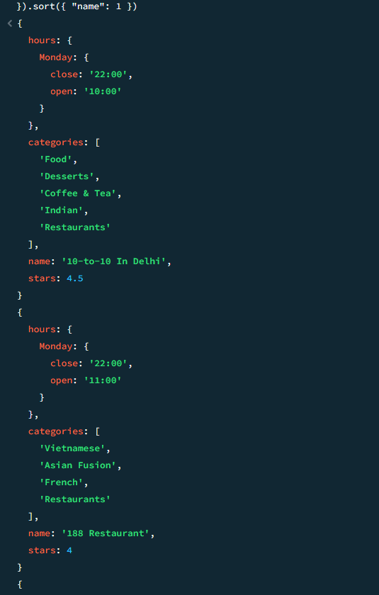
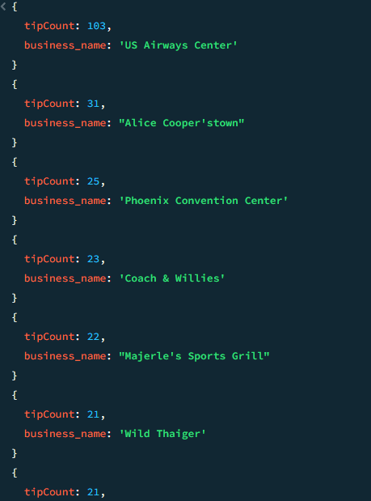
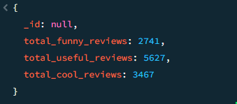
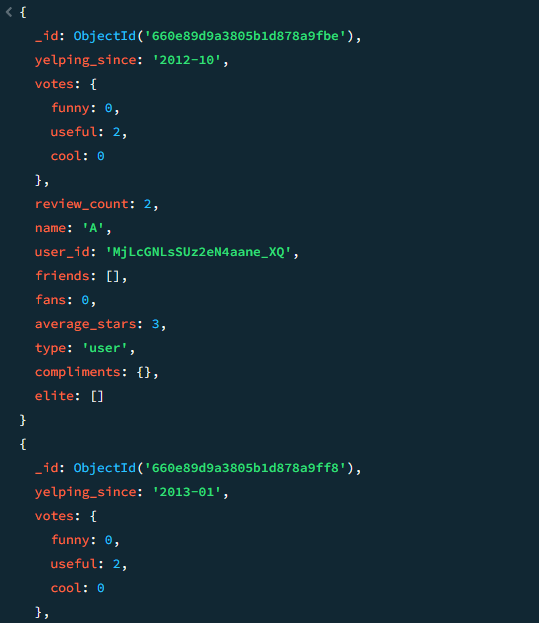
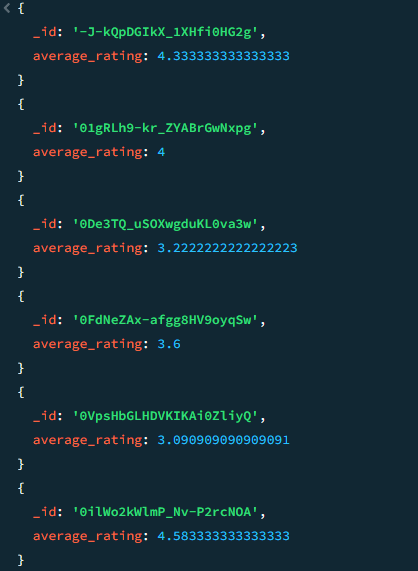
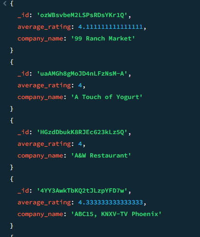

# Dokumentowe bazy danych – MongoDB

ćwiczenie 2


---

**Imiona i nazwiska autorów:** Tomasz Furgała, Łukasz Zegar, Konrad Tendaj

--- 


## Yelp Dataset

- [www.yelp.com](http://www.yelp.com) - serwis społecznościowy – informacje o miejscach/lokalach
- restauracje, kluby, hotele itd. `businesses`,
- użytkownicy odwiedzają te miejsca - "meldują się"  `check-in`
- użytkownicy piszą recenzje `reviews` o miejscach/lokalach i wystawiają oceny oceny,
- przykładowy zbiór danych zawiera dane z 5 miast: Phoenix, Las Vegas, Madison, Waterloo i Edinburgh.

# Zadanie 1 - operacje wyszukiwania danych

Dla zbioru Yelp wykonaj następujące zapytania

W niektórych przypadkach może być potrzebne wykorzystanie mechanizmu Aggregation Pipeline

[https://www.mongodb.com/docs/manual/core/aggregation-pipeline/](https://www.mongodb.com/docs/manual/core/aggregation-pipeline/)


1. Zwróć dane wszystkich restauracji (kolekcja `business`, pole `categories` musi zawierać wartość "Restaurants"), które są otwarte w poniedziałki (pole hours) i mają ocenę co najmniej 4 gwiazdki (pole `stars`).  Zapytanie powinno zwracać: nazwę firmy, adres, kategorię, godziny otwarcia i gwiazdki. Posortuj wynik wg nazwy firmy.

2. Ile każda firma otrzymała ocen/wskazówek (kolekcja `tip` ) w 2012. Wynik powinien zawierać nazwę firmy oraz liczbę ocen/wskazówek Wynik posortuj według liczby ocen (`tip`).

3. Recenzje mogą być oceniane przez innych użytkowników jako `cool`, `funny` lub `useful` (kolekcja `review`, pole `votes`, jedna recenzja może mieć kilka głosów w każdej kategorii).  Napisz zapytanie, które zwraca dla każdej z tych kategorii, ile sumarycznie recenzji zostało oznaczonych przez te kategorie (np. recenzja ma kategorię `funny` jeśli co najmniej jedna osoba zagłosowała w ten sposób na daną recenzję)

4. Zwróć dane wszystkich użytkowników (kolekcja `user`), którzy nie mają ani jednego pozytywnego głosu (pole `votes`) z kategorii (`funny` lub `useful`), wynik posortuj alfabetycznie według nazwy użytkownika.

5. Wyznacz, jaką średnia ocenę uzyskała każda firma na podstawie wszystkich recenzji (kolekcja `review`, pole `stars`). Ogranicz do firm, które uzyskały średnią powyżej 3 gwiazdek.

	a) Wynik powinien zawierać id firmy oraz średnią ocenę. Posortuj wynik wg id firmy.

	b) Wynik powinien zawierać nazwę firmy oraz średnią ocenę. Posortuj wynik wg nazwy firmy.

## Zadanie 1  - rozwiązanie

> Wyniki: 
> 
> przykłady, kod, zrzuty ekranów, komentarz ...

```js
1. 
db.business.find({
  "categories": "Restaurants",
  "hours.Monday.open": { $exists: true },
  "stars": { $gte: 4 }
}, {
  "name": 1,
  "address": 1,
  "categories": 1,
  "hours.Monday": 1,
  "stars": 1,
  "_id": 0
}).sort({ "name": 1 })
```



```js
2.
db.tip.aggregate([
  {
    $match: {
      date: { $gte: "2012-01-01", $lt: "2013-01-01" }
    }
  },
  {
    $group: {
      _id: "$business_id",
      tipCount: { $sum: 1 }
    }
  },
  {
    $lookup: {
      from: "business",
      localField: "_id",
      foreignField: "business_id",
      as: "business_info"
    }
  },
  {
    $project: {
      _id: 0,
      business_name: { $arrayElemAt: ["$business_info.name", 0] },
      tipCount: 1
    }
  },
  {
    $sort: {
      tipCount: -1
    }
  }
])
```
### UWAGA!
#### Ze względu na zbyt duży rozmiar pliku `trip.json`, co za tym idzie powyższe polecenie wykonywało się dość długo, zaimportowaliśmy tylko pierwsze 2000 dokumentów w celu przetestowania agragacji.


```js
3.
db.review.aggregate([
  {
    $group: {
      _id: null,
      total_funny_reviews: {
        $sum: { $cond: [{ $gt: ["$votes.funny", 0] }, 1, 0] }
      },
      total_useful_reviews: {
        $sum: { $cond: [{ $gt: ["$votes.useful", 0] }, 1, 0] }
      },
      total_cool_reviews: {
        $sum: { $cond: [{ $gt: ["$votes.cool", 0] }, 1, 0] }
      }
    }
  }
])
```
#### Tutaj również zaimportowaliśmy mniej danych




```js
4.
db.user.aggregate([
  {
    $match: {
      $or: [
        { "votes.funny": { $eq: 0 } },
        { "votes.useful": { $eq: 0 } }
      ]
    }
  },
  {
    $sort: { "name": 1 }
  }
])
```
#### Tutaj również zaimportowaliśmy mniej danych



```js
5a
db.review.aggregate([
  {
    $group: {
      _id: "$business_id",
      average_rating: { $avg: "$stars" }
    }
  },
  {
    $match: {
      average_rating: { $gt: 3 }
    }
  },
  {
    $sort: { _id: 1 }
  }
])
```




```js
db.review.aggregate([
  {
    $group: {
      _id: "$business_id",
      average_rating: { $avg: "$stars" }
    }
  },
  {
    $match: {
      average_rating: { $gt: 3 }
    }
  },
  {
    $lookup: {
      from: "business",
      localField: "_id",
      foreignField: "business_id",
      as: "business_info"
    }
  },
  {
    $unwind: "$business_info" 
  },
  {
    $project: {
      company_name: "$business_info.name", 
      average_rating: 1
    }
  },
  {
    $sort: { company_name: 1 } 
  }
])

```



---

# Zadanie 2 - modelowanie danych


Zaproponuj strukturę bazy danych dla wybranego/przykładowego zagadnienia/problemu

Należy wybrać jedno zagadnienie/problem (A lub B)

Przykład A
- Wykładowcy, przedmioty, studenci, oceny
	- Wykładowcy prowadzą zajęcia z poszczególnych przedmiotów
	- Studenci uczęszczają na zajęcia
	- Wykładowcy wystawiają oceny studentom
	- Studenci oceniają zajęcia

Przykład B
- Firmy, wycieczki, osoby
	- Firmy organizują wycieczki
	- Osoby rezerwują miejsca/wykupują bilety
	- Osoby oceniają wycieczki

a) Warto zaproponować/rozważyć różne warianty struktury bazy danych i dokumentów w poszczególnych kolekcjach oraz przeprowadzić dyskusję każdego wariantu (wskazać wady i zalety każdego z wariantów)

b) Kolekcje należy wypełnić przykładowymi danymi

c) W kontekście zaprezentowania wad/zalet należy zaprezentować kilka przykładów/zapytań/zadań/operacji oraz dla których dedykowany jest dany wariantów

W sprawozdaniu należy zamieścić przykładowe dokumenty w formacie JSON ( pkt a) i b)), oraz kod zapytań/operacji (pkt c)), wraz z odpowiednim komentarzem opisującym strukturę dokumentów oraz polecenia ilustrujące wykonanie przykładowych operacji na danych

Do sprawozdania należy kompletny zrzut wykonanych/przygotowanych baz danych (taki zrzut można wykonać np. za pomocą poleceń `mongoexport`, `mongdump` …) oraz plik z kodem operacji zapytań (załącznik powinien mieć format zip).


## Zadanie 2  - rozwiązanie

Do realizacji wybraliśmy **problem B**, firmy wycieczki, osoby.
#### a)
Rozważamy dwa róże podejścia w budowaniu struktury bazy danych.

Pierwsze składa się z dwóch kolekcji : Firmy, Wycieczki i Osoby, Firmy to kolekcja, która oprócz danych dotyczących firmy (np nazwa, adres) posiada dokumenty osadzone w postaci tablicy wycieczek oferowanych przez firmę, każda wycieczka posiada tablice rezerwacji. Osoby to kolekcja z danymi o uczestnikach wycieczek, również posiada dane osadzone - tablice rezerwowanych wycieczek przez daną osobę.

Zalety: 
- struktura prosta do czytania, zrozumienia jak i do implementacji
- korzystamy z możliwości osadzania dokumentów z różnych kolekcji w jednym dokumencie
- możemy w łatwy sposób pozyskać wszystkie potrzbne informacje np o osobie X jednym zapytaniem

Wady:
- Utrudnione akutalizowanie/dodanie danych
- Prowadzi do powielania danych

Drugi wariant to rozdzielenie wyżej opisanych dokumentów osadzonych do osobnych kolekcji. Wydzielilibyśmy kolekcje Rezerwacje i Wycieczki. To podejście wymaga użycia referencji w każdej kolekcji.

Zalety:
- minimalizacjia powielania danych
- ułatwiona aktualizacja danych
- lepsza skalowalność

Wady:
- zapytania są bardziej skomlikowane, złożone
- duża liczba referencji może spowodować spadek wydajności

Na potrzeby tego zadania lepiej sprawdzi się wariant pierwszy, z dwoma większymi kolekcjami. Ułatwi nam to tworzenie dokumentów oraz konstrukcje zapytań.

Poniżej przedstawiamy budowę kolekcji.
### Companies:
- _id
- name
- address
- trips
  - trip_id
  - trip_name
  - trip_date
  - price
  - reservations
    - person_id
    
### Persons:
- _id
- fristname
- lastname
- trips
  - trip_id

## Wariant drugi:
### Companies:
- _id
- name
- address
- trips
  - trip_id

### Persons:
- _id
- fristname
- lastname
- trips
  - trip_id

### Trips:
- _id
- trip_name
  - trip_date
  - price
  - reservations
    - person_id


Kolekcje wypełniamy odpowiednio przygotowanymi danymi w formacie JSON. Wykorzystujemy narzędzie MongodDB Compass.

Przykładowe dane dla kolekcji Companies:


```JSON
  {
  "_id": {
    "$oid": "661db47b0afa7327f060fedb"
  },
  "name": "Wakacje.pl",
  "adres": "Kraków, ul. Wakacyjna 1",
  "trips": [
    {
      "trip_id": "1",
      "trip_name": "Wycieczka do Gdańska",
      "price": 1500,
      "reservations": [
        {
          "id_osoby": "1"
        },
        {
          "id_osoby": "2"
        }
      ]
    }
  ]
}


```

Przykładowe dane dla kolekcji Persons:


```JSON
  {
  "_id": 1,
  "firstname": "Jan",
  "lastname": "Kowalski",
  "reservations": [
    {
      "company_id": 1,
      "trip_id": 1,
      "trip_price": 1500
    }
  ]
}


```

---

Punktacja:

|         |     |
| ------- | --- |
| zadanie | pkt |
| 1       | 0,6 |
| 2       | 1,4 |
| razem   | 2   |


