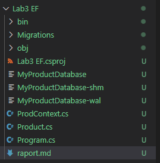
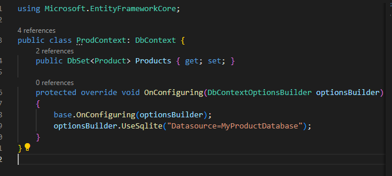
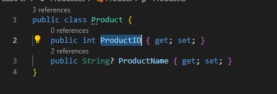
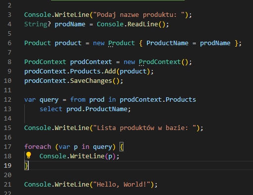
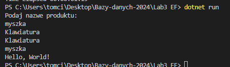
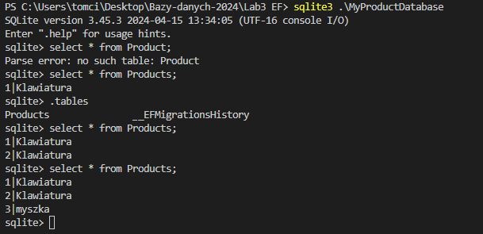

# Entity Framework

---

Imiona i nazwiska autorów: Tomasz Furgała, Konrad Tendaj, Łukasz Zegar

## Część I

Udało się zrealizować wszystko zgodnie z tym co było w instrukcji.

#### Widok projektu

#### DbContext

#### Product

#### Program.cs

#### Wykonanie Program.cs

#### Wyświetlenie bazy przy pomocy sqlite3

## Część II
