# **<p align="center">Wypożyczalnia filmów</p>**
#### **<p align="center">Zespół: Tomasz Furgała, Konrad Tendaj, Łukasz Zegar</p>**

<br>

### Spis treści
- [Aktorzy](#aktorzy)
- [Diagram bazy danych](#diagram-bazy-danych)
- [Opis tabel](#opis-tabel)
  - [Clients](#clients---tabela-zarejestrowanych-klientów-wypożyczalni)
  - [Reservation](#reservation---tabela-z-rezerwacjami-filmów-do-przyszłego-wypożyczenia)
  - [Rental](#rental---tabela-z-informacjami-o-wypożyczeniach-filmów-przez-klientów-aktualne-oraz-zwrócone)
  - [Copy](#copy---tabela-fizycznych-kopii-danego-filmu)
  - [Categories](#categories---tabela-kategorii-filmów)
  - [Movies](#movies---tabela-zawierająca-informacje-o-filmach)
  - [Actors](#actors---tabela-aktorów)
  - [Actors_in_movie](#actors_in_movie---tabela-łącząca-aktora-z-filmem-do-relacji-wiele-do-wielu)
- [Widoki](#widoki)
  - [vw_available_copies](#vw_available_copies)
  - [vw_currently_borrowed_copies](#vw_currently_borrowed_copies)
  - [vw_current_reservations](#vw_current_reservations)
  - [vw_movie_popularity](#vw_movie_popularity)
  - [vw_clients_delays_sum](#vw_clients_delays_sum)
  - [vw_actor_rentals](#vw_actor_rentals)
  - [vw_most_popular_actors_per_category](#vw_most_popular_actors_per_category)
  - [vw_movies_with_category](#vw_movies_with_category)
- [Funkcje](#funkcje)
  - [f_get_client_reservations](#f_get_client_reservations)
  - [f_is_copy_available](#f_is_copy_available)
  - [f_get_movies_by_category](#f_get_movies_by_category)
  - [f_check_client_exist](#f_check_client_exist)
  - [f_check_copy_exist](#f_check_copy_exist)
  - [f_user_has_reservation](#f_user_has_reservation)
  - [f_get_reservation_id](#f_get_reservation_id)
  - [f_get_available_copies_for_movie_id](#f_get_available_copies_for_movie_id)
  - [f_get_available_copies_for_movie_name](#f_get_available_copies_for_movie_name)
- [Procedury](#procedury)
  - [p_add_reservation](#p_add_reservation)
  - [p_change_reservation_status](#p_change_reservation_status)
  - [p_add_new_rental](#p_add_new_rental)
  - [p_return_rental](#p_return_rental)
  - [update_copy_availability](#update_copy_availability)
  - [p_add_client](#p_add_client)
  - [p_delete_client](#p_delete_client)
  - [p_update_client](#p_update_client)
- [Triggery](#triggery)
  - [t_copy_check_available](#t_copy_check_available)
  - [t_reservation_add](#t_reservation_add)
  - [t_reservation_update](#t_reservation_update)
  - [t_rental_add](#t_rental_add)
  - [t_rental_return](#t_rental_return)
  - [t_prevent_delete_client_with_rentals](#t_prevent_delete_client_with_rentals)
- [Backend](#backend)
  - [Połączenie z bazą danych](#połączenie-z-bazą-danych)
  - [Główna aplikacja](#główna-aplikacja)
  - [Wykonywanie poleceń](#wykonywanie-poleceń)
  - [Uruchomienie](#uruchomienie)
  - [Tabele](#tabele)
  - [Widoki](#widoki-1)
  - [Funkcje](#funkcje-1)
  - [Procedury](#procedury-1)
  - [Działanie procedur](#działanie-procedur)
    - [Anulowanie rezerwacji](#anulowanie-rezerwacji)
    - [Wypożyczenie filmu](#wypożyczenie-filmu)
    - [Zwrot filmu do wypożyczalni](#zwrot-filmu-do-wypożyczalni)
  - [Operacje CRUD](#operacje-crud)
    - [Dodanie nowego klienta](#dodanie-nowego-klienta)
    - [Aktualizacja klienta](#aktualizacja-klienta)
    - [Usunięcie klienta](#usunięcie-klienta)
    - [Wyświetlenie pełnej listy klientów](#wyświetlenie-pełnej-listy-klientów)
  - [Pozostały kod użyty w projekcie](#pozostały-kod-użyty-w-projekcie)

<br/><br/>

### Aktorzy

1. Klient:
    - może założyć konto, które umożliwia mu korzystanie z systemu,
    - może składać rezerwacje na wybrany film,
    - przegląda listę filmów oferowanych przez wypożyczalnie,
    - przeglądanie listy obecnie zarezerwowanych i wypożyczonych przez niego filmów.

2. Pracownik:
    - rejestruje wypożyczenie oraz zwracanie filmów w systemie,
    - może dodać nowe filmy i ich kopie do systemu,
    - może przeglądać rezerwacje i wypożyczenia klientów,
    - może generować raporty.
    
3. Administrator
    - może edytować, dodawać, usuwać tabele,
    - może edytować, dodawać, usuwać dane w tabelach,
    - może generować raporty.

<div style="page-break-after: always"></div>

### Diagram bazy danych
<p align="center">
  
</p>

---

### Opis tabel
#### `Clients` - tabela zarejestrowanych klientów wypożyczalni
- client_id - id klienta (to samo co login_id),
- firstname - imię,
- lastname - nazwisko,
- address - adres,
- phone - numer telefonu.

```sql
CREATE TABLE Clients (
    client_id integer  NOT NULL,
    firstname varchar2(20)  NOT NULL,
    lastname varchar2(20)  NOT NULL,
    address_id integer  NOT NULL,
    phone varchar2(15)  NOT NULL,
    CONSTRAINT Clients_pk PRIMARY KEY (client_id)
);
```


#### `Reservation` - tabela z rezerwacjami filmów do przyszłego wypożyczenia
- reservation_id - id rezerwacji,
- copy_id - id egzemplarza filmu,
- client_id - id klienta,
- reservation_date - data rezerwacji,
- reservation_expiry_date - data wygaśnięcia rezerwacji,
- status - akutalny status rezerwacji,
    - `N` - nowa rezerwacja,
    - `C` - rezerwacja anulowana,
    - `R` - rezerwacaj zrealizowana.

```sql
CREATE TABLE Reservation (
    reservation_id integer  NOT NULL,
    copy_id integer  NOT NULL,
    client_id integer  NOT NULL,
    reservation_date date  NOT NULL,
    reservation_expiry_date date  NOT NULL,
    status char(1)  NOT NULL,
    CONSTRAINT Reservation_pk PRIMARY KEY (reservation_id)
);
ALTER TABLE Reservation ADD CONSTRAINT Reservation_Clients
    FOREIGN KEY (client_id)
    REFERENCES Clients (client_id);
ALTER TABLE Reservation ADD CONSTRAINT Reservation_Copy
    FOREIGN KEY (copy_id)
    REFERENCES Copy (copy_id);
```

---

#### `Rental` - tabela z informacjami o wypożyczeniach filmów przez klientów (aktualne oraz zwrócone)
- rental_id - id wypożyczenia,
- client_id - id klienta,
- copy_id - id wypożyczonego egzemplarza,
- out_date - data wypożyczenia filmu,
- due_date - okres, na który film został wypożyczony,
- return_date - data faktycznego zwrotu filmu (null jeśli nie zwrócony).

```sql
CREATE TABLE Rental (
    rental_id integer  NOT NULL,
    client_id integer  NOT NULL,
    copy_id integer  NOT NULL,
    out_date date  NOT NULL,
    due_date date  NOT NULL,
    return_date date NULL default NULL,
    CONSTRAINT Rental_pk PRIMARY KEY (rental_id)
);
ALTER TABLE Rental ADD CONSTRAINT Copy_Rental
    FOREIGN KEY (copy_id)
    REFERENCES Copy (copy_id);
ALTER TABLE Rental ADD CONSTRAINT Rental_Clients
    FOREIGN KEY (client_id)
    REFERENCES Clients (client_id);
```

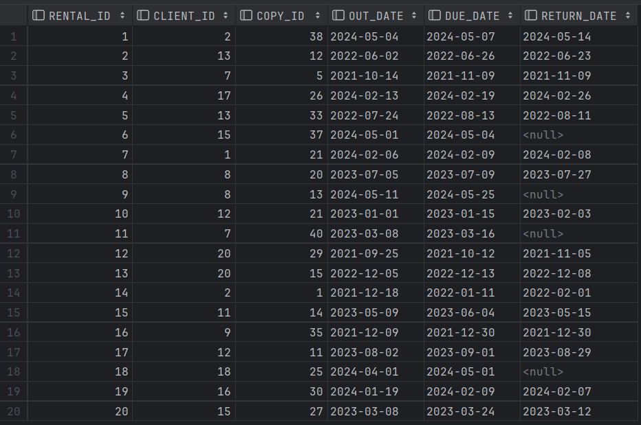
---

#### `Copy` - tabela fizycznych kopii danego filmu
- copy_id - id danej kopii,
- movie_id - id jej filmu,
- is_available - czy wypożyczona lub zarezerwowana ("Y", jeśli jest dostępna, "N" jeśli nie).

```sql
CREATE TABLE Copy (
    copy_id integer  NOT NULL,
    movie_id integer  NOT NULL,
    is_available char(1)  NOT NULL,
    CONSTRAINT Copy_pk PRIMARY KEY (copy_id)
);
ALTER TABLE Copy ADD CONSTRAINT Copy_Movies
    FOREIGN KEY (movie_id)
    REFERENCES Movies (movie_id);
```
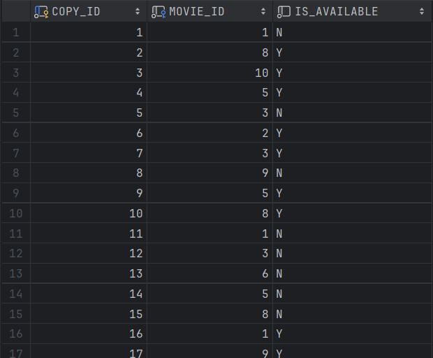

---

#### `Categories` - tabela kategorii filmów
- category_id - id kategorii,
- name - nazwa kategorii.
  
```sql
CREATE TABLE Categories (
    category_id int  NOT NULL,
    name varchar2(20)  NOT NULL,
    CONSTRAINT Categories_pk PRIMARY KEY (category_id)
);
```


---

#### `Movies` - tabela zawierająca informacje o filmach
- movie_id - id filmu,
- name - nazwa filmu,
- title - tytuł filmu,
- category_id - id głównej kategorii filmu,
- release_date - data globalna wydania filmu,
- duration - czas trwania filmu,
- rating - ocena filmu w skali 1 do 10,
- description - krótki opis filmu,
- production_country - kraj produkcji,
- director - imię i nazwisko reżysera.

```sql
CREATE TABLE Movies (
    movie_id int  NOT NULL,
    title varchar2(50) NOT NULL,
    category_id int  NOT NULL,
    release_date date  NOT NULL,
    duration timestamp  NOT NULL,
    rating int  NULL,
    description varchar2(100)  NULL,
    budget int  NULL,
    director varchar2(40)  NULL,
    CONSTRAINT Movies_pk PRIMARY KEY (movie_id)
);
ALTER TABLE Movies ADD CONSTRAINT Movies_Categories
    FOREIGN KEY (category_id)
    REFERENCES Categories (category_id);

```


---

#### `Actors` - tabela aktorów
- actor_id - id aktora,
- firstname - imię aktora,
- lastname - nazwisko aktora.

```sql
CREATE TABLE Actors (
    actor_id int  NOT NULL,
    firstname varchar2(20)  NOT NULL,
    lastname varchar2(20)  NOT NULL,
    CONSTRAINT Actors_pk PRIMARY KEY (actor_id)
);
```


---

#### `Actors_in_movie` - tabela łącząca aktora z filmem (do relacji wiele do wielu)
- movie_id - id filmu,
- actor_id - id aktora,
- role - rola aktora w filmie (jaką postać gra).

```sql
CREATE TABLE Actors_in_movie (
    movie_id int  NOT NULL,
    actor_id int  NOT NULL,
    role varchar2(20)  NOT NULL,
    CONSTRAINT Actors_in_movie_pk PRIMARY KEY (actor_id,movie_id)
);
ALTER TABLE Actors_in_movie ADD CONSTRAINT Actors_in_movie_Actors
    FOREIGN KEY (actor_id)
    REFERENCES Actors (actor_id);
ALTER TABLE Actors_in_movie ADD CONSTRAINT Actors_in_movie_Movies
    FOREIGN KEY (movie_id)
    REFERENCES Movies (movie_id);
```

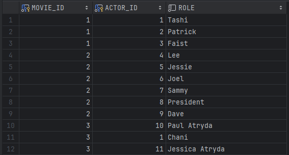

---

### Widoki

#### `vw_available_copies`

Widok dostępnych kopii filmów wyświetla listę dostępnych kopii filmów wraz z ich szczegółami, takimi jak id filmu, id kopii, tytuł filmu, kategorię, data wydania oraz czas trwania.

```sql
create or replace view VW_AVAILABLE_COPIES
AS
    SELECT m.MOVIE_ID, c.COPY_ID, m.TITLE,
    cat.NAME AS category_name, m.RELEASE_DATE, m.DURATION
    FROM Copy c
    JOIN Movies m ON c.movie_id = m.movie_id
    JOIN Categories cat ON m.category_id = cat.category_id
    WHERE c.is_available = 'Y'
```
```sql
select * from vw_available_copies;
```


---

#### `vw_currently_borrowed_copies`

Widok aktualnie wypożyczonych kopii z informacjami o kliencie, filmie oraz dniami opóźnienia lub 0 gdy nie minął termin zwrotu. Dane posortowane są w kolejności malejącej liczby dni opóźnienia zwrotu.

```sql
CREATE OR REPLACE VIEW vw_currently_borrowed_copies AS
    SELECT
        r.CLIENT_ID,
        cl.FIRSTNAME || ' ' || cl.LASTNAME AS Name,
        r.COPY_ID,
        m.TITLE,
        r.OUT_DATE,
        r.DUE_DATE,
        GREATEST(TRUNC(SYSDATE) - TRUNC(r.DUE_DATE), 0) AS Days_of_delay
    FROM
        RENTAL r
    JOIN
        COPY c ON c.COPY_ID = r.COPY_ID
    JOIN
        MOVIES m ON m.MOVIE_ID = c.MOVIE_ID
    JOIN
        CLIENTS cl ON cl.CLIENT_ID = r.CLIENT_ID
    WHERE
        RETURN_DATE IS NULL
    ORDER BY
        Days_of_delay DESC;
```
```sql
SELECT * FROM vw_currently_borrowed_copies;
```


---
#### `vw_current_reservations`

Widok rezerwacji aktualnych klientów pokazuje rezerwacje aktualnych klientów wraz z danymi klientów, filmami, na które zarezerwowali kopie, datami rezerwacji itp.

```sql
CREATE VIEW vw_current_reservations AS
SELECT r.reservation_id,
       c.client_id,
       c.firstname,
       c.lastname,
       m.title AS movie_title,
       r.reservation_date,
       r.reservation_expiry_date
FROM Reservation r
JOIN Clients c ON r.client_id = c.client_id
JOIN Copy co ON r.copy_id = co.copy_id
JOIN Movies m ON co.movie_id = m.movie_id
WHERE r.status = 'N';
```
```sql
select * from vw_current_reservations;
```


---

#### `vw_movie_popularity`
Widok pokazujący filmy od najpopularniejszego do najmniej popularnego względem sumarycznej liczby wypożyczeń jego kopii.

```sql
CREATE VIEW vw_movie_popularity AS
SELECT m.movie_id,
       m.title AS movie_title,
       COUNT(r.rental_id) AS num_rentals
FROM Movies m
LEFT JOIN Copy c ON m.movie_id = c.movie_id
LEFT JOIN Rental r ON c.copy_id = r.copy_id
GROUP BY m.movie_id, m.title
ORDER BY COUNT(r.rental_id) DESC;
```
```sql
select * from vw_movie_popularity;
```
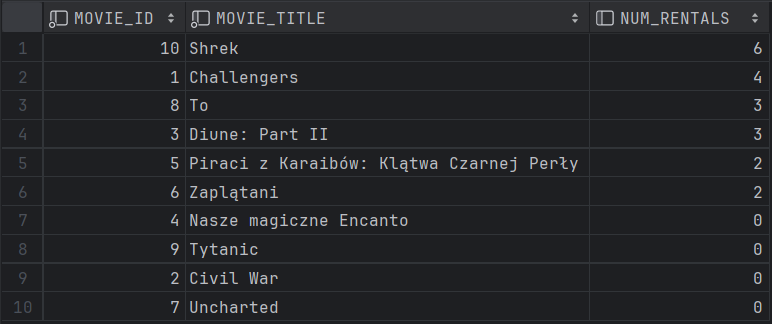

---

#### `vw_clients_delays_sum`

Widok pokazujący klientów i ich sumę spóźnień w oddawaniu filmów względem aktualnie wypożyczonych oraz tych już oddanych z opóźnieniem. Wyniki posortowane są od tych klientów z największą liczbą dni.

```sql
CREATE OR REPLACE VIEW vw_clients_delays_sum AS
SELECT
    cl.CLIENT_ID,
    cl.FIRSTNAME || ' ' || cl.LASTNAME AS Name,
    SUM(
        CASE
            WHEN r.RETURN_DATE IS NULL THEN
                GREATEST(TRUNC(SYSDATE) - TRUNC(r.DUE_DATE), 0)
            ELSE
                GREATEST(TRUNC(r.RETURN_DATE) - TRUNC(r.DUE_DATE), 0)
        END
    ) AS Total_days_of_delay
FROM
    RENTAL r
JOIN
    CLIENTS cl ON cl.CLIENT_ID = r.CLIENT_ID
GROUP BY
    cl.CLIENT_ID,
    cl.FIRSTNAME,
    cl.LASTNAME
ORDER BY
    Total_days_of_delay DESC;
```
```sql
SELECT * FROM vw_clients_delays_sum;
```


---
#### `vw_actor_rentals`

Widok przedstawiający listę aktorów występujących w obecnie wypożyczonych filmach oraz liczbę filmów, w których każdy aktor wystąpił.

```sql
CREATE OR REPLACE VIEW vw_actor_rentals AS
SELECT a.actor_id,
       a.firstname,
       a.lastname,
       COUNT(*) AS num_movies
FROM Actors a
JOIN Actors_in_movie aim ON a.actor_id = aim.actor_id
JOIN Movies m ON aim.movie_id = m.movie_id
JOIN Copy c ON m.movie_id = c.movie_id
JOIN Rental r ON c.copy_id = r.copy_id
GROUP BY a.actor_id, a.firstname, a.lastname;
```
```sql
SELECT * FROM VW_ACTOR_RENTALS;
```


---

#### `vw_most_popular_actors_per_category`

Widok przedstawia najpopularniejszego aktora występującego w filmach danej kategorii.  
Widok zawiera kolumny o nazwie kategorii, najpopularniejszym aktorze, liczbie filmów z tym aktorem w danej kategorii.

```sql
CREATE OR REPLACE VIEW vw_most_popular_actors_per_category AS
SELECT category_name,
       actor_name,
       movie_count
FROM (
    SELECT c.name AS category_name,
           a.firstname || ' ' || a.lastname AS actor_name,
           COUNT(*) AS movie_count,
           ROW_NUMBER() OVER (PARTITION BY c.category_id ORDER BY COUNT(*) DESC) AS actor_rank
    FROM Categories c
    JOIN Movies m ON c.category_id = m.category_id
    JOIN Actors_in_movie aim ON m.movie_id = aim.movie_id
    JOIN Actors a ON aim.actor_id = a.actor_id
    GROUP BY c.category_id, c.name, a.firstname, a.lastname
)
WHERE actor_rank = 1;
```
```sql
SELECT * FROM vw_most_popular_actors_per_category;
```
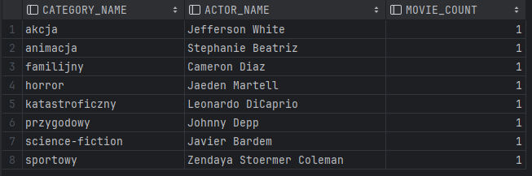

---

#### `vw_movies_with_category`

Widok wyświetla informacje o wszystkich filmach, które należą do wypożyczalni.
Do tabeli `Movies` zamiast wyświetlać `Category_Id` pokazujemy nazwę tej kategorii.

```sql
CREATE OR REPLACE VIEW vw_movies_with_category AS
SELECT
    c.name AS category_name,
    m.title AS movie_name,
    m.description AS movie_description,
    m.release_date,
    m.duration,
    m.rating,
    m.director
FROM Movies m
JOIN Categories c ON m.category_id = c.category_id;
```


---

### Funkcje

#### `f_get_client_reservations`

Funkcja ta umożliwia pobranie listy rezerwacji dla określonej osoby na podstawie jej identyfikatora klienta. Zwraca informacje o identyfikatorze rezerwacji, tytule filmu, dacie rezerwacji, dacie wygaśnięcia rezerwacji i statusie rezerwacji, co ułatwia zarządzanie rezerwacjami klientów w systemie wypożyczalni filmów.

```sql
CREATE OR REPLACE FUNCTION f_get_client_reservations(client_id_input INT)
RETURN SYS_REFCURSOR
IS
    is_person INT;
    reservation_cursor SYS_REFCURSOR;
BEGIN
    -- Sprawdzamy czy istnieje taka osoba w systemie
    SELECT count(*) INTO is_person FROM CLIENTS
    WHERE CLIENT_ID = client_id_input;
    IF is_person < 1
        THEN RAISE_APPLICATION_ERROR(-20000, 'Nie ma takiego użytkownika');
    END IF;

    OPEN reservation_cursor FOR
        SELECT r.reservation_id,
               m.title AS movie_title,
               r.reservation_date,
               r.reservation_expiry_date,
               r.status
        FROM Reservation r
        JOIN Copy c ON r.copy_id = c.copy_id
        JOIN Movies m ON c.movie_id = m.movie_id
        WHERE r.client_id = client_id_input;

    RETURN reservation_cursor;
END;
```
```sql
select f_get_client_reservations(1) from dual;
```

```sql
select f_get_client_reservations(73) from dual;
```


---

#### `f_is_copy_available`

Funkcja umożliwia sprawdzenie statusu konkretnej kopii filmu na podstawie jej identyfikatora. Zwraca informacje o tym, czy kopia jest aktualnie zarezerwowana, wypożyczona, dostępna, lub czy nie istnieje w bazie danych. Jest to przydatne narzędzie do zarządzania dostępnością kopii filmów w systemie wypożyczalni.

```sql
CREATE OR REPLACE FUNCTION f_is_copy_available(copy_id_input INT)
RETURN BOOLEAN
IS
    is_copy_anvailable CHAR(1);
BEGIN
    -- Sprawdzenie, czy kopia jest dostępna w tabeli Copy
    SELECT IS_AVAILABLE
    INTO is_copy_anvailable
    FROM Copy
    WHERE copy_id = copy_id_input;

    IF is_copy_anvailable = 'Y' THEN RETURN TRUE;
    ELSE RETURN FALSE;
    END IF;

EXCEPTION
    WHEN NO_DATA_FOUND THEN
        RETURN FALSE;
END;
```
```sql
BEGIN
    IF f_is_copy_available(1) THEN
        DBMS_OUTPUT.PUT_LINE('Copy is available.');
    ELSE
        raise_application_error(-20001, 'Copy is not available.');
    END IF;
END;
```
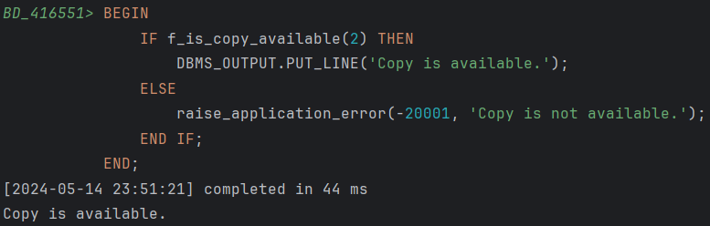

Gdy podamy copy_id = -1 to otrzymamy błąd:

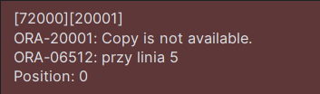
---


#### `f_get_movies_by_category`

Funkcja zwraca filmy należące do określonej kategorii na podstawie przekazanego identyfikatora kategorii. Zestawienie zawiera nazwę kategorii, tytuł filmu, opis filmu, datę premiery, czas trwania, ocenę, i reżysera.

```sql
CREATE OR REPLACE FUNCTION f_get_movies_by_category(category_id_input INT)
RETURN SYS_REFCURSOR
IS
    is_category INT;
    movie_cursor SYS_REFCURSOR;
BEGIN
    -- Sprawdzamy czy istnieje taka kategoria
    SELECT count(*) INTO is_category FROM CATEGORIES
    WHERE CATEGORY_ID = category_id_input;
    IF is_category < 1
        THEN RAISE_APPLICATION_ERROR(-20000, 'Nie ma takiej kategorii');
    END IF;

    OPEN movie_cursor FOR
        SELECT
            c.name AS category_name,
            m.title AS movie_name,
            m.description AS movie_description,
            m.release_date,
            m.duration,
            m.rating,
            m.director
        FROM Movies m
        JOIN Categories c ON m.category_id = c.category_id
        WHERE c.category_id = category_id_input;

    RETURN movie_cursor;
END;
```

```sql
select f_get_movies_by_category(2) from dual;
```

```sql
select f_get_movies_by_category(123) from dual;
```


---

#### `f_check_client_exist`
Funkcja ta sprawdza czy klient o podanym `client_id` istnieje w bazie danych. Funkcja zwraca odpowiednią wartość logiczną.
```sql
CREATE OR REPLACE FUNCTION f_check_client_exist(client_id_input INT) 
RETURN BOOLEAN
IS
    client_count INT;
BEGIN
    -- Sprawdzenie, czy istnieje osoba o podanym ID w tabeli Clients
    SELECT COUNT(*)
    INTO client_count
    FROM Clients
    WHERE client_id = client_id_input;

    -- Jeśli liczba znalezionych rekordów jest większa od zera, to osoba istnieje
    IF client_count > 0 THEN
        RETURN TRUE;
    ELSE
        RETURN FALSE;
    END IF;
END;
```
```sql
BEGIN
    IF f_check_client_exist(-1) THEN
        DBMS_OUTPUT.PUT_LINE('Client exists.');
    ELSE
        raise_application_error(-20001, 'Client does not exist.');
    END IF;
END;
```
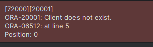

---

#### `f_check_copy_exist`

Funkcja sprawdza czy podana kopia z takim `copy_id` istnieje, zwraca odpowiednią wartość logiczną.
```sql
CREATE OR REPLACE FUNCTION f_check_copy_exist(copy_id_input INT) 
RETURN BOOLEAN
IS
    copy_count INT;
BEGIN
    SELECT COUNT(*)
    INTO copy_count
    FROM Copy
    WHERE copy_id = copy_id_input;

    -- Jeśli liczba znalezionych rekordów jest większa od zera, to kopia istnieje
    IF copy_count > 0 THEN
        RETURN TRUE;
    ELSE
        RETURN FALSE;
    END IF;
END;
```
```sql
BEGIN
    IF f_check_copy_exist(-1) THEN
        DBMS_OUTPUT.PUT_LINE('Copy exists.');
    ELSE
        raise_application_error(-20001, 'Copy does not exist.');
    END IF;
END;
```


---

#### `f_user_has_reservation`

Funkcja sprawdza czy podany użytkonik złożył wcześniej rezerwacje na konkretną kopię o podanym id. Zwraca odpowiednią wartość logiczną.

```sql
CREATE OR REPLACE FUNCTION f_user_has_reservation(
    user_id_input INT,
    copy_id_input INT
) RETURN BOOLEAN
IS
    v_count INT;
BEGIN
    SELECT COUNT(*)
    INTO v_count
    FROM Reservation
    WHERE CLIENT_ID = user_id_input
      AND copy_id = copy_id_input
      AND STATUS = 'N';

    RETURN v_count > 0;
EXCEPTION
    WHEN OTHERS THEN
        raise_application_error(-20001, 'Error checking reservation: ' || SQLERRM);
END;
```


```sql
BEGIN
    IF f_user_has_reservation(1, 1) THEN
        DBMS_OUTPUT.PUT_LINE('User has reservation.');
    ELSE
        raise_application_error(-20001, 'Reservation does not exist.');
    END IF;
END;
```

Przy wywołaniu tej funkcji nie pojawia się żaden błąd więc można wnioskować, że działa poprawnie.

---

#### `f_get_reservation_id`

Funkcja odpowiedzialna za pobranie oraz zwrócenie wartości `reservation_id` istniejącej rezerwacji z tabeli `Reservation` podając przy tym id użytkownika oraz id kopii.

```sql 
CREATE OR REPLACE FUNCTION f_get_reservation_id(
    user_id_input INT,
    copy_id_input INT
) RETURN INT
IS
    v_reservation_id INT;
BEGIN
    IF NOT F_USER_HAS_RESERVATION(user_id_input, copy_id_input) THEN
        raise_application_error(-20002, 'No such reservation.');
    END IF;

    SELECT reservation_id
    INTO v_reservation_id
    FROM Reservation
    WHERE CLIENT_ID = user_id_input
      AND COPY_ID = copy_id_input
      AND STATUS = 'N';

    RETURN v_reservation_id;
EXCEPTION
    WHEN NO_DATA_FOUND THEN
        raise_application_error(-20003, 'No matching reservation found.');
    WHEN OTHERS THEN
        raise_application_error(-20001, 'Error retrieving reservation_id: ' || SQLERRM);
END;
```
Użycie:  
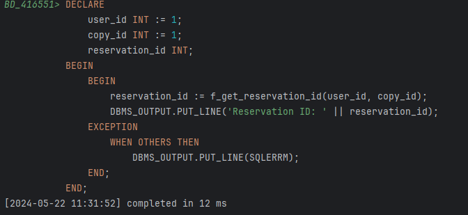

---

#### `f_get_available_copies_for_movie_id`

Funkcja zwraca listę wszystkich dostępnych kopii filmu o podanym id. Funkcja zwraca wszystkie kolumny z widoku `vw_available_copies`, czyli kolejno:  
id filmu, id kopii, tytuł filmu, kategoria, data wydania, czas trwania.
```sql
create or replace FUNCTION f_get_available_copies_for_movie_id(movie_id_input INT)
RETURN SYS_REFCURSOR
IS
    is_movie INT;
    movies_cursor SYS_REFCURSOR;
BEGIN
    -- Sprawdzamy czy istnieje taki film w systemie
    SELECT count(*) INTO is_movie FROM MOVIES
    WHERE MOVIE_ID = movie_id_input;
    IF is_movie < 1 THEN
        RAISE_APPLICATION_ERROR(-20000, 'Nie ma takiego filmu');
    END IF;

    OPEN movies_cursor FOR
        SELECT *
        FROM VW_AVAILABLE_COPIES c
        WHERE c.MOVIE_ID = movie_id_input;

    RETURN movies_cursor;
END;
```
```sql
select f_get_available_copies_for_movie_id(5) from dual;
```


---

#### `f_get_available_copies_for_movie_name`

Funkcja zwraca listę wszystkich dostępnych kopii filmu o podobnej nazwie. Funkcja zwraca wszystkie kolumny z widoku `vw_available_copies`, czyli kolejno:  
id filmu, id kopii, tytuł filmu, kategoria, data wydania, czas trwania.
```sql
create or replace FUNCTION f_get_available_copies_for_movie_name(movie_name_input VARCHAR2)
RETURN SYS_REFCURSOR
IS
    is_movie INT;
    movies_cursor SYS_REFCURSOR;
BEGIN
    -- Sprawdzamy czy istnieje taki film w systemie (ignorując wielkość liter)
    SELECT count(*) INTO is_movie FROM MOVIES
    WHERE UPPER(TITLE) LIKE '%' || UPPER(movie_name_input) || '%';
    IF is_movie < 1 THEN
        RAISE_APPLICATION_ERROR(-20000, 'Nie ma takiego filmu o podobnym tytule');
    END IF;

    OPEN movies_cursor FOR
        SELECT *
        FROM VW_AVAILABLE_COPIES c
        WHERE UPPER(c.TITLE) LIKE '%' || UPPER(movie_name_input) || '%';

    RETURN movies_cursor;
END;
```
```sql
select F_GET_AVAILABLE_COPIES_FOR_MOVIE_NAME('piraci') from dual;
```


---

### Procedury

#### `p_add_reservation`

Procedura odpowiedzialna za dodanie nowej rezerwacji do tabeli `Reservations`.  
Na początku sprawdzamy argument o długości wypożyczenia. Później obliczamy datą wygaśnięcia rezerwacji i wstawiamy te dane do tabeli.

```sql
CREATE OR REPLACE PROCEDURE p_add_reservation(
    client_id_input INT,
    copy_id_input INT,
    rental_duration_input INT
)
IS
    reservation_date_input DATE := SYSDATE;
    reservation_expiry_date_input DATE;
BEGIN
    -- Sprawdzenie, czy podana długość wypożyczenia jest większa niż 0
    IF rental_duration_input <= 0 THEN
        raise_application_error(-20001, 'Rental duration must be greater than 0.');
    END IF;

    -- Obliczenie daty wygaśnięcia rezerwacji poprzez dodanie liczby dni do daty rezerwacji
    reservation_expiry_date_input := reservation_date_input + rental_duration_input;
    
    -- Wstawianie nowej rezerwacji do tabeli Reservation
    INSERT INTO Reservation (client_id, copy_id, reservation_date, reservation_expiry_date, status)
    VALUES (client_id_input, copy_id_input, reservation_date_input, reservation_expiry_date_input, 'N');

    DBMS_OUTPUT.PUT_LINE('Reservation added successfully.');
EXCEPTION
    WHEN OTHERS THEN
        raise_application_error(-20002, 'Error adding reservation: ' || SQLERRM);
END;
```

Użycie:
```sql
BEGIN
    P_ADD_RESERVATION(1, 1, 10);
END;
```


---

#### `p_change_reservation_status`

Procedura odpowiedzialna za zmianę statusu rezerwacji. Jeżeli nowy status jest `C` (cancelled) to zmienia pole `is_available` w tabeli `Copy` na `Y` (dostępna), w przeciwnym przypadku ustawia tą wartość na `N` (niedostępna).

```sql
CREATE OR REPLACE PROCEDURE p_change_reservation_status(
    reservation_id_input INT,
    new_status_input CHAR
)
IS
    reservation_exists INT;
BEGIN
    -- Sprawdzenie, czy podane reservation_id istnieje
    SELECT COUNT(*)
    INTO reservation_exists
    FROM Reservation
    WHERE reservation_id = reservation_id_input;

    IF reservation_exists = 0 THEN
        raise_application_error(-20001, 'Reservation with the given ID does not exist.');
    END IF;

    -- Aktualizacja statusu rezerwacji
    UPDATE Reservation
    SET status = new_status_input
    WHERE reservation_id = reservation_id_input;

    -- Aktualizacja stanu dostępności kopii w tabeli Copy
    IF new_status_input = 'C' THEN
        UPDATE Copy
        SET is_available = 'Y'
        WHERE copy_id IN (SELECT copy_id FROM Reservation WHERE reservation_id = reservation_id_input);
    ELSE
        UPDATE Copy
        SET is_available = 'N'
        WHERE copy_id IN (SELECT copy_id FROM Reservation WHERE reservation_id = reservation_id_input);
    END IF;

    DBMS_OUTPUT.PUT_LINE('Reservation status updated successfully.');
EXCEPTION
    WHEN OTHERS THEN
        raise_application_error(-20003, 'Error updating reservation status: ' || SQLERRM);
END;
```
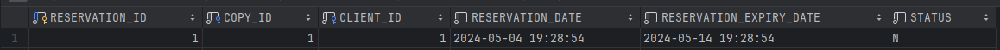

I teraz spróbujemy anulować rezerwacje:

```sql
begin
    p_change_reservation_status(1,'C');
end;    
```


I zmiana w tabeli `Copy`:

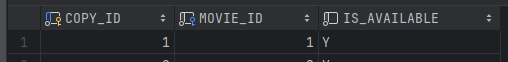

---
#### `p_add_new_rental`

Procedura jest odpowiedzialna za dodawanie nowego wypożyczenia. Jeżeli użytkownik złożył wcześniej rezerwację to procedura zmienia status rezerwacji w tabeli `Reservation`. Jeśli użytkownik nie złożył rezerwacji to procedura zmienia status kopii na niedostępną w tabeli `Copy`.
    
```sql
CREATE OR REPLACE PROCEDURE p_add_new_rental(
    client_id_input INT,
    copy_id_input INT,
    rental_duration_input INT
)
IS
    reservation_date_input DATE := SYSDATE;
    reservation_expiry_date_input DATE;
    v_reservation_id INT;
BEGIN

    -- Sprawdzenie, czy podana długość wypożyczenia jest większa niż 0
    IF rental_duration_input <= 0 THEN
        raise_application_error(-20001, 'Rental duration must be greater than 0.');
    END IF;

    -- Obliczenie daty wygaśnięcia rezerwacji poprzez dodanie liczby dni do daty rezerwacji
    reservation_expiry_date_input := reservation_date_input + rental_duration_input;

    IF F_USER_HAS_RESERVATION(client_id_input, copy_id_input) THEN
        -- jeśli użytkownik złożył wcześniej rezerwacje to zmień status w tabeli Reservation
        v_reservation_id := F_GET_RESERVATION_ID(client_id_input, copy_id_input);
        P_CHANGE_RESERVATION_STATUS(v_reservation_id, 'R');
    ELSIF NOT F_IS_COPY_AVAILABLE(copy_id_input) THEN
        raise_application_error(-20002, 'Error: Cannot rent unavailable copy');
    ELSE
        -- jeśli użytkownik nie złożył wcześniej rezerwacji to zmień status w tabeli Copy
        UPDATE Copy
        SET is_available = 'N'
        WHERE copy_id = copy_id_input;
    END IF;


    -- Wstawienie nowego wypożyczenia do tabeli Rental
    INSERT INTO Rental (client_id, copy_id, out_date, due_date, return_date)
    VALUES (client_id_input, copy_id_input, reservation_date_input, reservation_expiry_date_input, null);

    DBMS_OUTPUT.PUT_LINE('New rental added successfully.');
EXCEPTION
    WHEN OTHERS THEN
        raise_application_error(-20003, 'Error adding new rental: ' || SQLERRM);
END;
```

Użycie:

Kopia o id = 2 jest dostępna:

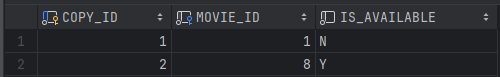

po wykonaniu procedury:

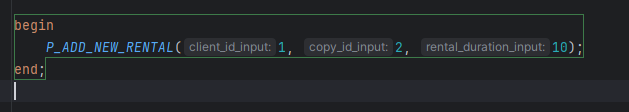

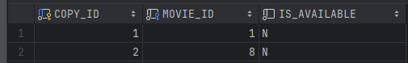

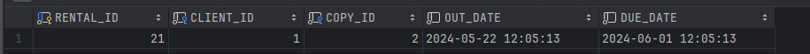

--- 

#### `p_return_rental`

Procedura opowiedzialna za zwrot kopii i uzupełnienie daty zwrotu `RETURN_DATE` w `Rental`. Odpowiada fizycznemu zwrotowi filmu do wypożyczalni.

```sql
create PROCEDURE P_RETURN_RENTAL (rental_id_input INT)
IS
    v_count INT;
BEGIN
    -- Sprawdzamy czy istnieje takie wypożyczenie
    SELECT COUNT(*) INTO v_count
    FROM Rental
    WHERE rental_id = rental_id_input AND RETURN_DATE IS NOT NULL;
    IF v_count = 0 THEN
        raise_application_error(-20002, 'Rental ID does not exist or it was returned.');
    END IF;

    UPDATE RENTAL
    SET RETURN_DATE = SYSDATE
    WHERE RENTAL_ID = rental_id_input;

    DBMS_OUTPUT.PUT_LINE('Copy returned successfully.');

EXCEPTION
    WHEN OTHERS THEN
        raise_application_error(-20001, 'Error removing rental: ' || SQLERRM);
END;
```

Użycie: 

Przed: 


Po wykonaniu:

```sql
begin
    p_return_rental(6);
end;
```
Kopia o copy_id = 37 jest teraz dostępna:

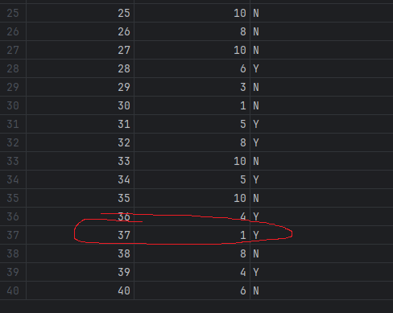

I oczywiście uzupełnia się wtedy pole `RETURN_DATE`.


---
#### `update_copy_availability`
Procedura odpowiedzialna za aktualizację pola `IS_AVAILABLE` w tabeli `Copy` w przypadku, gdy występują pewne nieprawidłowości. Sprawdzamy czy dana kopia jest zarezerwowana lub wypożyczona. Jeśli tak to poprawiamy pole na `Y`. Jeśli nie to ustawiamy na `N`.
```sql
CREATE OR REPLACE PROCEDURE update_copy_availability IS
BEGIN
    FOR copy_record IN (SELECT COPY_ID FROM COPY) LOOP
        DECLARE
            v_rental_count NUMBER;
            v_reservation_count NUMBER;
        BEGIN
            -- Sprawdzamy, czy kopia jest wypożyczona
            SELECT COUNT(*) INTO v_rental_count
            FROM RENTAL
            WHERE COPY_ID = copy_record.COPY_ID
              AND RETURN_DATE IS NULL;

            -- Sprawdzamy, czy kopia jest zarezerwowana
            SELECT COUNT(*) INTO v_reservation_count
            FROM RESERVATION
            WHERE STATUS = 'N' AND COPY_ID = copy_record.COPY_ID;

            -- Aktualizujemy dostępność kopii
            IF v_rental_count > 0 OR v_reservation_count > 0 THEN
                UPDATE COPY
                SET is_available = 'N'
                WHERE COPY_ID = copy_record.COPY_ID;
            ELSE
                UPDATE COPY
                SET is_available = 'Y'
                WHERE COPY_ID = copy_record.COPY_ID;
            END IF;
        END;
    END LOOP;

    COMMIT;
END;
```
W ten sposób można z niej skorzystać:

```sql
BEGIN
    update_copy_availability();
END;
```

#### `p_add_client`

Procedura P_ADD_CLIENT dodaje nowego klienta do tabeli `CLIENTS` z podanymi danymi: imieniem, nazwiskiem, adresem i numerem telefonu. Jeśli podczas dodawania klienta wystąpi błąd, procedura zgłasza komunikat.

```sql
create PROCEDURE P_ADD_CLIENT (
    p_firstname IN VARCHAR2,
    p_lastname IN VARCHAR2,
    p_address IN VARCHAR2,
    p_phone IN VARCHAR2
) AS
BEGIN
    BEGIN
        INSERT INTO CLIENTS (FIRSTNAME, LASTNAME, ADDRESS, PHONE)
        VALUES (p_firstname, p_lastname, p_address, p_phone);
    EXCEPTION
        WHEN OTHERS THEN
            RAISE_APPLICATION_ERROR(-20001, 'Error adding client: ' || SQLERRM);
    END;
END p_add_client;
```

Przykład użycia:

```sql
BEGIN
    p_add_client('Jan', 'Krakowski', 'Warszawa, ul. Krakowskie Przedmieście 1', '123456789');
END;
```

Rezultat - nowy klient został dodany:


#### `p_delete_client`

Procedura umożliwa usunięcie klienta z tabeli  `Clients` znające jego `id`. Operacja jest niemożliwa do wykonania gdy w bazie nie występuje taki klient lub gdy klient ma na wypożyczeniu jakiś film.

```sql
create PROCEDURE P_DELETE_CLIENT (
    p_client_id IN NUMBER
) AS
    v_exists NUMBER;
BEGIN
    SELECT COUNT(*) INTO v_exists FROM CLIENTS WHERE CLIENT_ID = p_client_id;
    
    IF v_exists = 0 THEN
        RAISE_APPLICATION_ERROR(-20002, 'Client does not exist.');
    END IF;

    BEGIN
        DELETE FROM CLIENTS 
        WHERE CLIENT_ID = p_client_id;
    EXCEPTION
        WHEN OTHERS THEN
            RAISE_APPLICATION_ERROR(-20003, 'Error deleting client: ' || SQLERRM);
    END;
END P_DELETE_CLIENT;
```
Wykorzystanie procedury:
```sql
BEGIN
    P_DELETE_CLIENT(61); -- Jan Kowalski
END;
```

Klient został usunięty

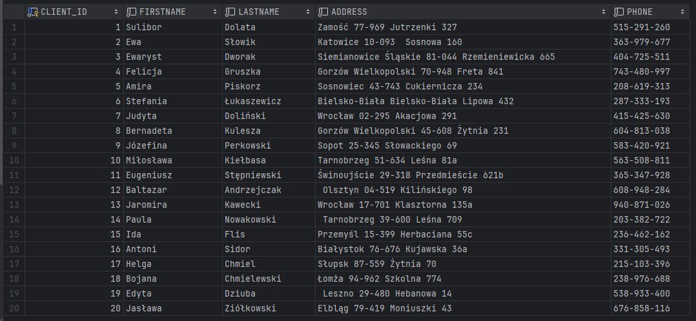

```sql
BEGIN
    P_DELETE_CLIENT(62); -- Nie ma takiego klienta
END;
```


#### `p_update_client`

Procedura umożliwa modyfikacje danych klienta z tabeli  `Clients`. Jeśli klient o podanym identyfikatorze nie istnieje, procedura zgłasza wyjątek z komunikatem.

```sql
create PROCEDURE P_UPDATE_CLIENT (
    p_client_id IN NUMBER,
    p_firstname IN VARCHAR2,
    p_lastname IN VARCHAR2,
    p_address IN VARCHAR2,
    p_phone IN VARCHAR2
) AS
    v_exists NUMBER;
BEGIN
    SELECT COUNT(*) INTO v_exists FROM CLIENTS WHERE CLIENT_ID = p_client_id;

    IF v_exists = 0 THEN
        RAISE_APPLICATION_ERROR(-20004, 'Client does not exist.');
    END IF;

    BEGIN
        UPDATE CLIENTS
        SET FIRSTNAME = p_firstname, LASTNAME = p_lastname, ADDRESS = p_address, PHONE = p_phone
        WHERE CLIENT_ID = p_client_id;
    EXCEPTION
        WHEN OTHERS THEN
            RAISE_APPLICATION_ERROR(-20005, 'Error updating client: ' || SQLERRM);
    END;
END P_UPDATE_CLIENT;
```

Wykorzystanie procedury:
```sql
BEGIN
    p_update_client(1, 'Janusz', 'Kowalski', 'Kraków, ul. Floriańska 2', '987654321');
END;
```

I dane klienta o Id = 1 zostały zaaktualizowane


```sql
BEGIN
    p_update_client(100, 'Dariusz', 'Michalski', 'Kraków, ul. Floriańska 2', '987654321'); -- Nie ma takiego klienta
END;
```

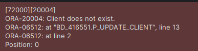

---

### Triggery

#### `t_copy_check_available`

Triger sprawdza przed dodaniem lub aktualizacją rekordu w tabeli `Copy`, czy pole `is_available` ma wartość `N` albo `Y`.

```sql
CREATE OR REPLACE TRIGGER t_copy_check_available
BEFORE INSERT OR UPDATE OF is_available ON Copy
FOR EACH ROW
BEGIN
    IF :NEW.is_available NOT IN ('Y', 'N') THEN
        raise_application_error(-20001, 'Invalid value for is_available column. Value must be "Y" or "N".');
    END IF;
END;
```

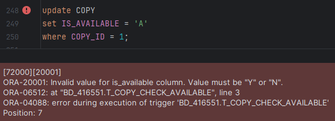

---
#### `t_reservation_add`

Triger odpowiada za walidację danych przy dodawaniu nowej rezerwacji oraz za zmianę statusu w tabeli `Copy`.  
Sprawdzamy czy istnieje taki użytkownik i kopia oraz sprawdzamy czy można zarezerwować tę kopię.

```sql
CREATE OR REPLACE TRIGGER t_reservation_add
BEFORE INSERT ON reservation
FOR EACH ROW
DECLARE
    copy_available BOOLEAN;
BEGIN
    IF NOT f_check_client_exist(:NEW.client_id) THEN
        raise_application_error(-20001, 'Client with the given ID does not exist.');
    END IF;

    IF NOT f_check_copy_exist(:NEW.copy_id) THEN
        raise_application_error(-20002, 'Copy with the given ID does not exist.');
    END IF;

    -- Wywołanie funkcji F_IS_COPY_AVAILABLE i przypisanie wyniku do zmiennej copy_available
    copy_available := f_is_copy_available(:NEW.copy_id);

    -- Sprawdzenie, czy kopia jest już zarezerwowana lub wypożyczona
    IF NOT copy_available THEN
        raise_application_error(-20003, 'Copy is already reserved or rented.');
    END IF;

    -- Sprawdzenie, czy status rezerwacji jest poprawny
    IF :NEW.status <> 'N' THEN
        raise_application_error(-20004, 'Invalid reservation status. Status must be "N".');
    END IF;

    -- Aktualizacja pola is_available na wartość 'N' w tabeli Copy
    UPDATE copy SET is_available = 'N' WHERE copy_id = :NEW.copy_id;
END;
```
Test trigera - na początku osoba o id=1 rezerwuje film o copy_id=1, a następnei osoba o id=2 próbuje zarezerwować ten sam film:
Pierwsza operacja - wszystko działa:
```sql
BEGIN
    P_ADD_RESERVATION(1, 1, 10);
END;
```
Drugie polecenie - pojawia się błąd:
```sql
BEGIN
    P_ADD_RESERVATION(2, 1, 10);
END;
```

---

#### `t_reservation_update`

Triger sprawdza czy nowy status składa się ze znaku `C`, `N` czy `R` oraz aktualizuje status dostępności w tabeli `Copy`.

```sql
CREATE OR REPLACE TRIGGER t_reservation_update
BEFORE UPDATE ON Reservation
FOR EACH ROW
DECLARE
    new_status_input CHAR(1);
BEGIN
    -- Przypisanie nowego statusu do zmiennej
    new_status_input := :NEW.status;

    -- Sprawdzenie, czy nowy status jest prawidłowy
    IF new_status_input NOT IN ('N', 'C', 'R') THEN
        raise_application_error(-20001, 'Invalid status. Status must be "N", "C", or "R".');
    END IF;

    -- Aktualizacja stanu dostępności kopii w tabeli Copy
    IF new_status_input = 'C' THEN
        UPDATE Copy
        SET is_available = 'Y'
        WHERE copy_id = :NEW.copy_id;
    ELSE
        UPDATE Copy
        SET is_available = 'N'
        WHERE copy_id = :NEW.copy_id;
    END IF;
END;
```

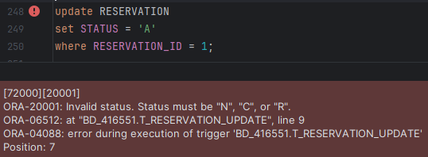

---
#### `t_rental_add`

Triger odpowiada za zmianę statusu kopii w tabeli `Copy` przy dodawaniu nowego wypożyczenia.

```sql
CREATE OR REPLACE TRIGGER t_rental_add
BEFORE INSERT ON Rental
FOR EACH ROW
BEGIN
    -- Aktualizacja stanu dostępności kopii w tabeli Copy
    UPDATE Copy
    SET is_available = 'N'
    WHERE copy_id = :NEW.copy_id;

    DBMS_OUTPUT.PUT_LINE('Rental added successfully.');
EXCEPTION
    WHEN OTHERS THEN
        raise_application_error(-20001, 'Error updating rental: ' || SQLERRM);
END;
```

---
#### `t_rental_return`

Triger odpowiada za zmianę statusu kopii w tabeli `Copy` przy zwracaniu wypożyczenia.

```sql
CREATE OR REPLACE TRIGGER t_rental_return
AFTER UPDATE ON Rental
FOR EACH ROW
BEGIN
    -- Sprawdamy czy zmiana dotyczyła zwrotu filmu
    IF :OLD.return_date IS NULL AND :NEW.return_date IS NOT NULL THEN
        -- Aktualizacja stanu dostępności kopii w tabeli Copy
        UPDATE Copy
        SET is_available = 'Y'
        WHERE copy_id = :OLD.copy_id;

        DBMS_OUTPUT.PUT_LINE('Rental returned successfully.');
    END IF;
EXCEPTION
    WHEN OTHERS THEN
        raise_application_error(-20001, 'Error returning rental: ' || SQLERRM);
END;

```
#### `t_prevent_delete_client_with_rentals`

Trigger `T_PREVENT_DELETE_CLIENT_WITH_RENTALS` uniemożliwia usunięcie klienta z tabeli `CLIENTS`, jeśli ma on wypożyczone filmy z nieuzupełnioną datą zwrotu w tabeli RENTAL, w takim przypadku trigger zgłasza błąd z komunikatem "Nie można usunąć klienta, który ma wypożyczone filmy"

```sql
create trigger T_PREVENT_DELETE_CLIENT_WITH_RENTALS
    before delete
    on CLIENTS
    for each row
DECLARE
    v_rentals_count NUMBER;
BEGIN
    -- Sprawdzenie, czy klient ma wypożyczone filmy
    SELECT COUNT(*)
    INTO v_rentals_count
    FROM RENTAL
    WHERE CLIENT_ID = :OLD.CLIENT_ID
      AND RETURN_DATE IS NULL;

    IF v_rentals_count > 0 THEN
        RAISE_APPLICATION_ERROR(-20001, 'Nie można usunąć klienta, który ma wypożyczone filmy.');
    END IF;
END;

```
Przykład działania:

Klient o `id=6` nie oddał jeszcze filmu. Trigger zablokuje usunięcie danego klienta


---
<br />

## **<p align="center">Backend</p>**

Aplikacja została zrealizowana w `Pythonie`, przy użyciu frameworka `Flask`.

### Połączenie z bazą danych

W pliku `base.py` łączymy sie z bazą danych przy pomocy modułu `cx_Oracle`, który umożliwia interakcję z bazą danych `Oracle` za pomocą języka `Python`. Funkcja odczytuje plik `config.txt` z nazwą użytkownika i hasłem do bazy danych by móc nawiązać połączenie.

```python
import cx_Oracle

global conn

def connect_to_data_base():
    global conn
    try:
        with open('MiniProjekt/backend/config.txt', 'r') as file:
            lines = file.readlines()

        config_data = {}

        for line in lines:
            key, value = line.strip().split(' = ')
            config_data[key] = value

        lib_dir = "C:\instantclient_21_13"
        user = config_data['user']
        password = config_data['password']
        dsn = cx_Oracle.makedsn("dbmanage.lab.ii.agh.edu.pl", 1521, sid="DBMANAGE")

        cx_Oracle.init_oracle_client(lib_dir=lib_dir)
        conn = cx_Oracle.connect(user=user, password=password, dsn=dsn, encoding="UTF-8")

        return conn

    except cx_Oracle.Error as error:
        print("Błąd podczas łączenia z bazą danych:", error)
        return None
```

### Główna aplikacja

Ten kod konfiguruje aplikację webową za pomocą frameworka `Flask`, która umożliwia interakcję z bazą danych poprzez różne komponenty, takie jak tabele, widoki, procedury składowane i funkcje. Po uruchomieniu aplikacji, główna strona `(http://localhost:5000)` wyświetla dostępne tabele, widoki i funkcje oraz domyślnie pokazuje dane klienta o identyfikatorze 1.

```python
from flask import Flask, render_template
from base import connect_to_data_base
from tables import tables, tables_blueprint
from views import views, views_blueprint
from procedures import procedures_blueprint
from functions import functions, functions_blueprint

app = Flask(__name__)
app.config['JSON_AS_ASCII'] = False

conn = connect_to_data_base()
app.register_blueprint(tables_blueprint)
app.register_blueprint(views_blueprint)
app.register_blueprint(procedures_blueprint)
app.register_blueprint(functions_blueprint)

# http://localhost:5000
@app.route('/')
def index():
    return render_template(
            'main.html',
            tables=tables,
            views=views,
            functions=functions,
            default_client_id=1   # Domyślnie wyświetlany klient
            )

if __name__ == '__main__':
    app.run(debug=True)
```

### Wykonywanie poleceń:

Funkcja `execute_querry` wykonuje podane zapytanie SQL do bazy danych przy użyciu biblioteki cx_Oracle. Zwraca listę wyników zapytania lub słownik z komunikatem błędu, obsługując również możliwość cofnięcia transakcji w przypadku wystąpienia problemu.

```python
def execute_querry(sql: str) -> list[any] | dict[str, str]:
    if conn is None:
        return {'error': 'Błąd podczas łączenia z bazą danych'}

    try:
        cursor = conn.cursor()
        cursor.execute(sql)
        rows = cursor.fetchall() if cursor.description else []
        cursor.close()
        return rows

    except cx_Oracle.Error as error:
        if conn:
            conn.rollback()
        print("Błąd podczas wykonania zapytania:", error)
        return {'error': str(error)}
```

\
Funkcja `call_function` wykonuje wywołanie funkcji przechowywanej w bazie danych Oracle, przekazując jej argumenty, a następnie zwraca wynik jako listę wierszy wynikowych. Obsługuje również błędy związane z połączeniem z bazą danych i wyjątki z biblioteki cx_Oracle, umożliwiając roll-back transakcji w przypadku wystąpienia problemu.

```python
def call_function(func_name: str, args: list[int | str]) -> dict[str, any]:
    if conn is None:
        return {'error': 'Błąd podczas łączenia z bazą danych'}

    try:
        cursor = conn.cursor()
        result_cursor = cursor.var(cx_Oracle.CURSOR)
        cursor.callfunc(func_name, result_cursor, args)
        result_cursor = result_cursor.getvalue()
        rows = result_cursor.fetchall() if result_cursor else []
        cursor.close()
        return rows
    except cx_Oracle.Error as error:
        if conn:
            conn.rollback()
        print("Błąd podczas wykonania funckji:", error)
        return {'error': str(error)}
```

\
Funkcja `call_procedure` wykonuje procedurę przechowywaną w bazie danych Oracle, przekazując jej argumenty i zatwierdzając zmiany w bazie danych po jej wykonaniu. Obsługuje błędy związane z połączeniem z bazą danych oraz wyjątki z biblioteki cx_Oracle, umożliwiając roll-back transakcji w przypadku wystąpienia problemu podczas wykonywania procedury. Funkcja zwraca komunikat o pomyślnym wykonaniu procedury lub informację o błędzie.

```python
def call_procedure(proc_name: str, args: list[int | str]) -> dict[str, any]:
    if conn is None:
        return {'error': 'Błąd podczas łączenia z bazą danych'}

    try:
        cursor = conn.cursor()
        cursor.callproc(proc_name, args)
        conn.commit()
        cursor.close()
        return {'message': f'Procedure {proc_name} executed successfully'}
    except cx_Oracle.Error as error:
        if conn:
            conn.rollback()
        print("Błąd podczas wykonania procedury:", error)
        return {'error': str(error)}
```

\
Funkcja `get_table_data` pobiera nazwy kolumn oraz dane z określonej tabeli w bazie danych, a następnie renderuje je w szablonie HTML. Parametry opcjonalne display_name i comment służą do dodatkowego dostosowania wyglądu wyrenderowanej tabeli.

```python
def get_table_data(table_name: str, display_name: str = "", comment: str = "") -> str:
    column_names_packed = execute_querry(
        f"SELECT column_name FROM USER_TAB_COLUMNS WHERE table_name = '{table_name.upper()}'"
    )
    column_names = [item for sublist in column_names_packed for item in sublist]
    data = execute_querry(f"SELECT * FROM {table_name}")
    return render_template('table.html',
                           table_name=table_name,
                           column_names=column_names,
                           data=data,
                           comment=comment,
                           display_name=display_name,
                           )
```

\
Funkcja `execute_and_render` wykonuje podane zapytanie do bazy danych za pomocą funkcji `execute_querry`, a następnie renderuje wynikowy szablon HTML przy użyciu `render_template`. Jeśli wykonanie zapytania zakończy się błędem, funkcja zwraca komunikat o błędzie. W przeciwnym razie zwraca szablon HTML z danymi zapytania, które są przekazane pod nazwą określoną przez parametr `value_name`.

```python
def execute_and_render(query: str, template_url: str, value_name: str = 'data') -> str:
    result = execute_querry(query)
    if 'error' in result:
        return f"Wystąpił błąd: {result['error']}", 500
    else:
        return render_template(template_url, **{value_name: result})
```

### Uruchomienie

Po uruchomieniu pliku `main.py` (zawartość jest pokazana wyżej) i wpisaniu w przegldądarce `http://localhost:5000` pokazuje się wybór możliwych endpointów.


\
Szablon strony internetowej, który wyświetla naszą stronę startową:

```html
<!doctype html>
<html lang="pl">
<head>
    <meta charset="UTF-8">
    <title>Elementy z bazy danych</title>
    <style>
        body {
            font-family: Arial, sans-serif;
            background-color: #eeeeee;
            color: #333;
            margin: 0;
            padding: 0;
            display: flex;
            flex-direction: column;
            align-items: center;
        }
        h2 {
            color: #757575;
            margin-top: 20px;
            text-align: center;
        }
        ul {
            list-style-type: none;
            padding: 0;
        }
        li {
            background: #fdfdfd;
            margin: 10px 0;
            padding: 0;
            border-radius: 5px;
            box-shadow: 0 2px 4px rgba(0, 0, 0, 0.1);
            overflow: hidden;
        }
        li a {
            text-decoration: none;
            color: #606060;
            font-weight: bold;
            display: block;
            padding: 10px;
            width: 100%;
            height: 100%;
        }
        li a:hover {
            color: #fff;
            background-color: #757575;
        }
        .container {
            width: 80%;
            max-width: 800px;
            margin: 20px auto;
            padding: 50px;
            background: #f7f7f7;
            border-radius: 10px;
            box-shadow: 0 2px 10px rgba(0, 0, 0, 0.1);
        }
    </style>
</head>
<body>

    <div class="container">
        <h2>Lista tabeli w bazie:</h2>
        <ul>
            
                <li><a href="{{ url_for(table[0]) }}">{{ table[1] }}</a></li>
            
        </ul>

        <br>

        <h2>Lista widoków:</h2>
        <ul>
            
                <li><a href="{{ url_for(view[0]) }}">{{ view[1] }}</a></li>
            
        </ul>
        
        <br>

        <h2>Lista funkcji:</h2>
        <ul>
            
                <li><a href="{{ url_for(func[0], client_id=default_client_id) }}">{{ func[1] }}</a></li>
            
        </ul>

        <br>
        
        <h2>Zarządzanie klientami</h2>
        <ul>
            <li><a href="{{ url_for('procedures.add_client_form') }}">Dodaj klienta</a></li>
            <li><a href="{{ url_for('procedures.delete_client_form') }}">Usuń klienta</a></li>
            <li><a href="{{ url_for('procedures.update_client_form') }}">Zaktualizuj klienta</a></li>
            <li><a href="{{ url_for('tables.get_Clients') }}">Lista klientów</a></li>
        </ul>
    </div>

</body>
</html>
```

### Tabele

Do wyświetlania tabel stworzyliśmy osobny plik `tables.py` z endpoint'ami do każdej tabeli, które następnie wywołują funckje `get_table_data()` odpowiedzialną za wygenerowanie odpowiedniej tabeli.

```python
from flask import Blueprint
from base import get_table_data


tables_blueprint = Blueprint('tables', __name__)

tables = (
    ('tables.get_Clients', 'Clients'),
    ('tables.get_Reservation', 'Reservation'),
    ('tables.get_Rental', 'Rental'),
    ('tables.get_Copy', 'Copy'),
    ('tables.get_Categories', 'Categories'),
    ('tables.get_Movies', 'Movies'),
    ('tables.get_Actors', 'Actors'),
    ('tables.get_Actors_in_movie', 'Actors_in_movie'),
)


@tables_blueprint.route('/tables/Clients')
def get_Clients():
    return get_table_data('Clients')

@tables_blueprint.route('/tables/Reservation')
def get_Reservation():
    return get_table_data('Reservation')

@tables_blueprint.route('/tables/Rental')
def get_Rental():
    return get_table_data('Rental')

@tables_blueprint.route('/tables/Copy')
def get_Copy():
    return get_table_data('Copy')

@tables_blueprint.route('/tables/Categories')
def get_Categories():
    return get_table_data('Categories')

@tables_blueprint.route('/tables/Movies')
def get_Movies():
    return get_table_data('Movies')

@tables_blueprint.route('/tables/Actors')
def get_Actors():
    return get_table_data('Actors')

@tables_blueprint.route('/tables/Actors_in_movie')
def get_Actors_in_movie():
    return get_table_data('Actors_in_movie')

```


Dane są wyświetlane w tabelce dzięki plikowi `table.html`

```html
<!DOCTYPE html>
<html lang="en">
<head>
    <meta charset="UTF-8">
    <meta name="viewport" content="width=device-width, initial-scale=1.0">
    <title>All Rentals</title>
    <style>
        body {
            font-family: Arial, sans-serif;
            background-color: #eeeeee;
            color: #333;
        }
        table {
            width: 70%;
            border-collapse: collapse;
            margin: auto;
        }
        th, td {
            border: 1px solid rgb(125, 125, 125);
            padding: 8px;
            text-align: left;
        }
        th {
            text-align: center;
        }
        th {
            background-color: #d5d5d5;
        }
        h2, p {
            text-align: center;
        }
    </style>
</head>
<body>
    <br>
    <a href="../">< Powrót do strony głównej</a>

    
        <h2>Wszystkie dane z {{ table_name }}:</h2>
    
        <h2>Wszystkie dane z {{ display_name }}:</h2>
    

    
        <p>{{comment}}</p>
    
    <br>
    <table border="1">
        <thead>
            <tr>
                
                    <th>{{ column }}</th>
                
            </tr>
        </thead>
        <tbody>
            
                <tr>
                    
                        <td>{{ cell }}</td>
                    
                </tr>
            
        </tbody>
    </table>
</body>
</html>
```

### Widoki


\
Stworzyliśmy osobny plik zawierający endponty dla widoków:

```python
from flask import Blueprint, request, render_template
from base import execute_and_render, get_table_data, call_function


views_blueprint = Blueprint('views', __name__)

views = (
    ('views.VW_MOVIE_POPULARITY', 'Movie Popularity'),
    ('views.VW_CURRENT_RESERVATIONS', 'Current Reservations'),
    ('views.VW_AVAILABLE_COPIES', 'Available Copies (filtrowanie, rezerwacja)'),
    ('views.VW_ACTOR_RENTALS', 'Actor Rentals'),
    ('views.VW_MOST_POPULAR_ACTORS_PER_CATEGORY', 'Actors Per Category'),
    ('views.VW_CLIENTS_DELAYS_SUM', 'Clients Delays Summary'),
    ('views.VW_CURRENTLY_BORROWED_COPIES', 'Currently Borrowed Copies'),
)

@views_blueprint.route('/VW_MOVIE_POPULARITY')
def VW_MOVIE_POPULARITY():
    return get_table_data('VW_MOVIE_POPULARITY', display_name='Movie Popularity')


@views_blueprint.route('/VW_CURRENT_RESERVATIONS')
def VW_CURRENT_RESERVATIONS():
    return get_table_data('VW_CURRENT_RESERVATIONS', display_name='Current Reservations')
    

@views_blueprint.route('/VW_AVAILABLE_COPIES', methods=['GET', 'POST'])   # dostępne kopie wyszukiwaniem i funkcją rezerwacji
def VW_AVAILABLE_COPIES():
    if request.method == 'GET':
        return execute_and_render("select * from VW_AVAILABLE_COPIES", 'views/available_copies.html', 'copies')
    
    movie_id = request.form.get('movie_id')
    movie_name = request.form.get('movie_name')
    print("Arguments:", movie_id, movie_name)

    if movie_id:
        print("Movie ID:", movie_id)
        result = call_function('f_get_available_copies_for_movie_id', [int(movie_id)])
        print("Result:", result)
        if 'error' in result:
            result = []
        return render_template('views/available_copies.html', copies=result)
    elif movie_name:
        print("Movie Name:", movie_name)
        result = call_function('f_get_available_copies_for_movie_name', [movie_name])
        print("Result:", result)
        if 'error' in result:
            result = []
        return render_template('views/available_copies.html', copies=result)
    else:
        return execute_and_render("select * from VW_AVAILABLE_COPIES", 'views/available_copies.html', 'copies')


@views_blueprint.route('/VW_ACTOR_RENTALS')
def VW_ACTOR_RENTALS():
    return get_table_data('VW_ACTOR_RENTALS', display_name='Actor Rentals')


@views_blueprint.route('/VW_MOST_POPULAR_ACTORS_PER_CATEGORY')
def VW_MOST_POPULAR_ACTORS_PER_CATEGORY():
    return get_table_data('VW_MOST_POPULAR_ACTORS_PER_CATEGORY', display_name='Most Popular Actors Per Category')


@views_blueprint.route('/VW_CLIENTS_DELAYS_SUM')
def VW_CLIENTS_DELAYS_SUM():
    return get_table_data('VW_CLIENTS_DELAYS_SUM',
                          display_name='Clients Delays Summary',
                          comment='This view displays the total days of delay for each client.')
    

@views_blueprint.route('/VW_CURRENTLY_BORROWED_COPIES')
def VW_CURRENTLY_BORROWED_COPIES():
    return get_table_data('VW_CURRENTLY_BORROWED_COPIES', 
                          display_name='Currently Borrowed Copies',
                          comment='This view displays all copies that are currently borrowed.')
```

\
Widok `VW_AVAILABLE_COPIES` przedstawiający możliwość złożenia rezerwacji na dostępne filmy. Możliwe jest wyszukanie filmu jaki nas interesuje po nazwie. 

Endpoint dla tego widoku:

```python
@views_blueprint.route('/VW_AVAILABLE_COPIES', methods=['GET', 'POST'])   # dostępne kopie wyszukiwaniem i funkcją rezerwacji
def VW_AVAILABLE_COPIES():
    if request.method == 'GET':
        return execute_and_render("select * from VW_AVAILABLE_COPIES", 'views/available_copies.html', 'copies')
    
    movie_id = request.form.get('movie_id')
    movie_name = request.form.get('movie_name')
    print("Arguments:", movie_id, movie_name)

    if movie_id:
        print("Movie ID:", movie_id)
        result = call_function('f_get_available_copies_for_movie_id', [int(movie_id)])
        print("Result:", result)
        if 'error' in result:
            result = []
        return render_template('views/available_copies.html', copies=result)
    elif movie_name:
        print("Movie Name:", movie_name)
        result = call_function('f_get_available_copies_for_movie_name', [movie_name])
        print("Result:", result)
        if 'error' in result:
            result = []
        return render_template('views/available_copies.html', copies=result)
    else:
        return execute_and_render("select * from VW_AVAILABLE_COPIES", 'views/available_copies.html', 'copies')
```

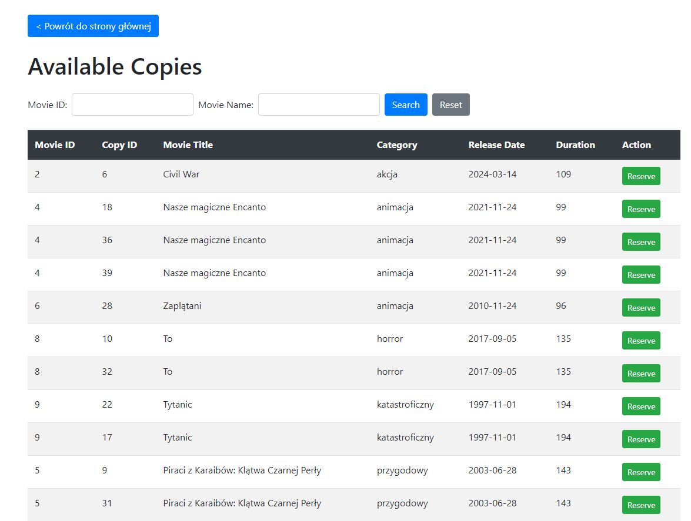

Możemy oczywiście przeszukiwać zbiór dostępnych kopii:


Po kliknięciu przycisku `Reserve` otwiera się formularz z danymi do wypełnienia


Po wypełnieniu danych możemy zobaczyć, ży wykonana została procedura odpowiedzialna za dodanie nowej rezerwacji. I pojawiła się nowa rezerwacja na film o nazwie "Civil War":


### Funkcje

Plik `functions.py` odpowiedzialny za tworzenie endpointów dla funkcji z bazy danych, które zwracają widoki tabel.

```python
from flask import Blueprint, request, render_template, redirect, url_for
from base import call_function, execute_querry


functions_blueprint = Blueprint('functions', __name__)

functions = (
        ('functions.filter_movies', 'Search movies (po kategoriach)'),
        ('functions.client_reservations', 'Client Reservations (po id klienta)'),
        ('procedures.rent_movie_form', 'Rent movie (formularz do wypożyczania)'),
        ('procedures.return_movie_form', 'Return movie (formularz do zwrotów)'),
    )


@functions_blueprint.route('/filter_movies', methods=['GET', 'POST'])
def filter_movies():
    if request.method == 'POST':
        category_id = request.form['category_id']
        result = call_function('f_get_movies_by_category', [int(category_id)])
        
        if 'error' in result:
            return f"Error: {result['error']}", 500
        else:
            movies = result
    else:
        movies = get_all_movies()

    return render_template('views/movie_filter_form.html', categories=get_categories(), movies=movies)

def get_all_movies():
    query = "SELECT * FROM vw_movies_with_category"
    movies = execute_querry(query)
    return movies

def get_categories():
    query = "SELECT category_id, name FROM Categories"
    categories = execute_querry(query)
    return categories


@functions_blueprint.route('/client_reservations/<int:client_id>')
def client_reservations(client_id):
    result = call_function("f_get_client_reservations", [int(client_id)])
        
    if 'error' in result:
        return f"Wystąpił błąd: {result['error']}", 500
    else:
        return render_template('functions/get_client_reservations.html', reservations=result, client_id=client_id)

@functions_blueprint.route('/client_reservations', methods=['POST'])
def redirect_client_reservations():
    client_id = request.form.get('client_id')
    return redirect(url_for('functions.client_reservations', client_id=client_id))

```

\
Przykład funckji wyświetlający listę wszystkich filmów w wypożyczali z możliwością filtrowania po kategorii.

Enpoint dla tej funkcji:

```python
@functions_blueprint.route('/filter_movies', methods=['GET', 'POST'])
def filter_movies():
    if request.method == 'POST':
        category_id = request.form['category_id']
        result = call_function('f_get_movies_by_category', [int(category_id)])
        
        if 'error' in result:
            return f"Error: {result['error']}", 500
        else:
            movies = result
    else:
        movies = get_all_movies()

    return render_template('views/movie_filter_form.html', categories=get_categories(), movies=movies)
```


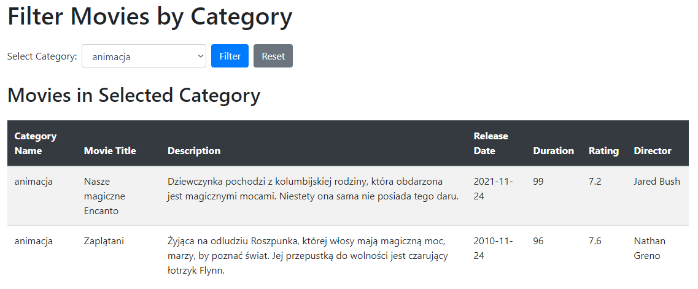

### Procedury

Plik `procedures.py` zawiera endpointy dla procedur z naszej bazy danych

```python
from flask import Blueprint, request, render_template, redirect, url_for
from base import call_procedure, get_table_data


procedures_blueprint = Blueprint('procedures', __name__)

@procedures_blueprint.route('/reserve', methods=['POST'])
def reserve():
    copy_id = request.form['copy_id']
    return render_template('procedures/reservation_form.html', copy_id=copy_id)

@procedures_blueprint.route('/add_reservation', methods=['POST'])
def add_reservation():
    client_id = request.form['client_id']
    copy_id = request.form['copy_id']
    rental_duration = request.form['rental_duration']
    
    result = call_procedure('p_add_reservation', [int(client_id), int(copy_id), int(rental_duration)])
    
    if 'error' in result:
        return "Error: " + result['error'], 500
    else:
        return redirect(url_for('views.VW_AVAILABLE_COPIES'))

@procedures_blueprint.route('/cancel_reservation/<int:reservation_id>', methods=['POST'])
def cancel_reservation(reservation_id):
    client_id = request.form.get('data-client-id')  # Odczytaj client_id z atrybutu data-client-id

    if client_id is None:
        return "Error: Client ID is missing", 400
    
    new_status = 'C'

    result = call_procedure('p_change_reservation_status', [int(reservation_id), new_status])
    if 'error' in result:
        return "Error: " + result['error'], 500
    else:
        return redirect(url_for('functions.client_reservations', client_id=client_id))

@procedures_blueprint.route('/rent_movie_form', methods=['GET'])
def rent_movie_form():
    return render_template('functions/rent_movie_form.html')

@procedures_blueprint.route('/rental', methods=['POST'])
def rental():
    client_id = request.form['client_id']
    copy_id = request.form['copy_id']
    rental_duration = request.form['rental_duration']

    result = call_procedure('p_add_new_rental', [int(client_id), int(copy_id), int(rental_duration)])
    
    if 'error' in result:
        return "Error: " + result['error'], 500
    else:
        return redirect('http://localhost:5000')
    
@procedures_blueprint.route('/return_movie_form', methods=['GET'])
def return_movie_form():
    return render_template('procedures/return_movie_form.html')


@procedures_blueprint.route('/return_movie', methods=['POST'])
def return_movie():
    rental_id = request.form['rental_id']

    result = call_procedure('P_RETURN_RENTAL', [int(rental_id)])
    
    if 'error' in result:
        return "Error: " + result['error'], 500
    else:
        return redirect('http://localhost:5000')

@procedures_blueprint.route('/add_client_form', methods=['GET'])
def add_client_form():
    return render_template('procedures/add_client_form.html')

@procedures_blueprint.route('/add_client', methods=['POST'])
def add_client():
    firstname = request.form['firstname']
    lastname = request.form['lastname']
    address = request.form['address']
    phone = request.form['phone']

    result = call_procedure('p_add_client', [firstname, lastname, address, phone])
    
    if 'error' in result:
        return "Error: " + result['error'], 500
    else:
        return redirect(url_for('index'))

@procedures_blueprint.route('/delete_client_form', methods=['GET'])
def delete_client_form():
    return render_template('procedures/delete_client_form.html')

@procedures_blueprint.route('/delete_client', methods=['POST'])
def delete_client():
    client_id = request.form['client_id']

    result = call_procedure('p_delete_client', [int(client_id)])
    
    if 'error' in result:
        return "Error: " + result['error'], 500
    else:
        return redirect(url_for('index'))

@procedures_blueprint.route('/update_client_form', methods=['GET'])
def update_client_form():
    return render_template('procedures/update_client_form.html')

@procedures_blueprint.route('/update_client', methods=['POST'])
def update_client():
    client_id = request.form['client_id']
    firstname = request.form['firstname']
    lastname = request.form['lastname']
    address = request.form['address']
    phone = request.form['phone']

    result = call_procedure('p_update_client', [int(client_id), firstname, lastname, address, phone])
    
    if 'error' in result:
        return "Error: " + result['error'], 500
    else:
        return redirect(url_for('index'))
```

### Działanie procedur

#### Anulowanie rezerwacji

Wcześniej pokazaliśmy tworzenie rezerwacji przez klienta, a teraz anulowanie rezerwacji - po kliknięciu `cancel` rezerwacja zmienia swój stacu na `C`(canceled):

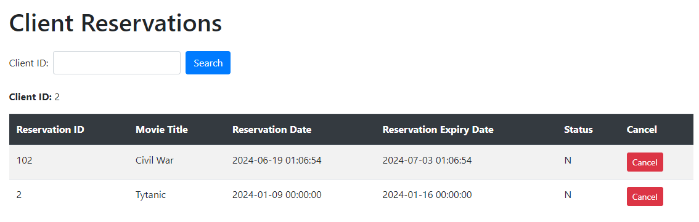

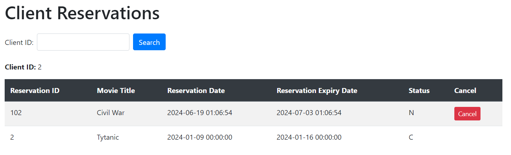

#### Wypożyczenie filmu

Po kliknięciu linku możemy wypełnić formularz do wypożyczenia filmu. Musimy podać `CopyId` i `ClientId` oraz możemy ustawić czas trwania wypożyczenia.

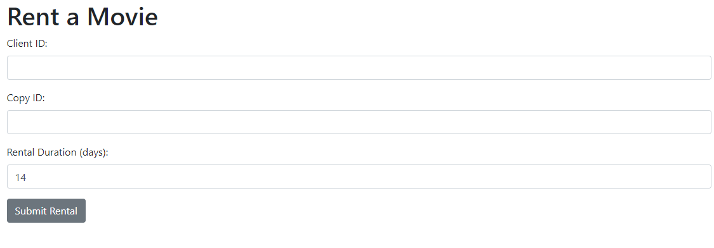

```python
@procedures_blueprint.route('/return_movie', methods=['POST'])
def return_movie():
    rental_id = request.form['rental_id']

    result = call_procedure('P_RETURN_RENTAL', [int(rental_id)])
    
    if 'error' in result:
        return "Error: " + result['error'], 500
    else:
        return redirect('http://localhost:5000')

```

Przykładowe dane:


I w tabeli rental na samym końcy pojawiło się nowe wypożyczenie:


#### Zwrot filmu do wypożyczalni

Spróbujmy zwrócić przedchwilą wypożyczony film. Po kliknięciu w link do zwrotu ukazyuje nam się formularz do zwrotu filmu.


```python
@procedures_blueprint.route('/return_movie_form', methods=['GET'])
def return_movie_form():
    return render_template('procedures/return_movie_form.html')


@procedures_blueprint.route('/return_movie', methods=['POST'])
def return_movie():
    rental_id = request.form['rental_id']

    result = call_procedure('P_RETURN_RENTAL', [int(rental_id)])
    
    if 'error' in result:
        return "Error: " + result['error'], 500
    else:
        return redirect('http://localhost:5000')
```

I widzimy, że film został zwrócony.


### Operacje CRUD

Zrealizowaliśmy opracje CRUD na tabeli `Clients`

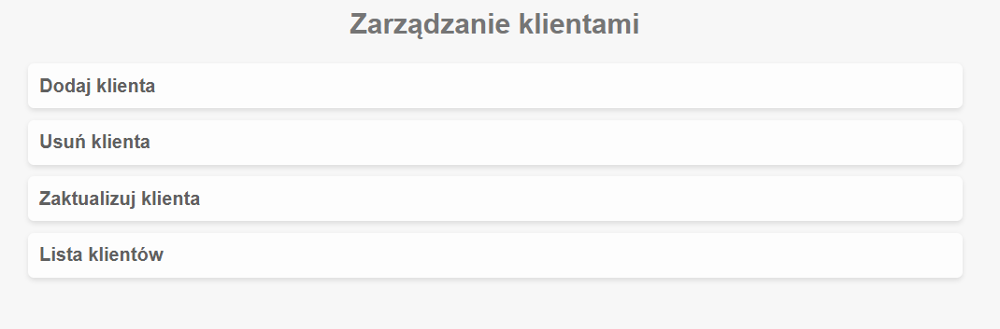


#### Dodanie nowego klienta

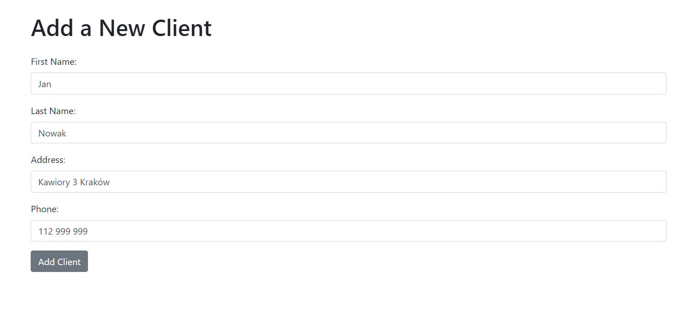

```python

@procedures_blueprint.route('/add_client_form', methods=['GET'])
def add_client_form():
    return render_template('procedures/add_client_form.html')

@procedures_blueprint.route('/add_client', methods=['POST'])
def add_client():
    firstname = request.form['firstname']
    lastname = request.form['lastname']
    address = request.form['address']
    phone = request.form['phone']

    result = call_procedure('p_add_client', [firstname, lastname, address, phone])
    
    if 'error' in result:
        return "Error: " + result['error'], 500
    else:
        return redirect(url_for('index'))
```


#### Aktualizacja klienta


```python
@procedures_blueprint.route('/update_client_form', methods=['GET'])
def update_client_form():
    return render_template('procedures/update_client_form.html')

@procedures_blueprint.route('/update_client', methods=['POST'])
def update_client():
    client_id = request.form['client_id']
    firstname = request.form['firstname']
    lastname = request.form['lastname']
    address = request.form['address']
    phone = request.form['phone']

    result = call_procedure('p_update_client', [int(client_id), firstname, lastname, address, phone])
    
    if 'error' in result:
        return "Error: " + result['error'], 500
    else:
        return redirect(url_for('index'))
```


#### Usunięcie klienta


```python
@procedures_blueprint.route('/delete_client_form', methods=['GET'])
def delete_client_form():
    return render_template('procedures/delete_client_form.html')

@procedures_blueprint.route('/delete_client', methods=['POST'])
def delete_client():
    client_id = request.form['client_id']

    result = call_procedure('p_delete_client', [int(client_id)])
    
    if 'error' in result:
        return "Error: " + result['error'], 500
    else:
        return redirect(url_for('index'))
```

I klient został usunięty


#### Wyświetlenie pełnej listy klientów


### Pozostały kod użyty w projekcie

Szkielet do pokazania rezerwacji klienta - `get_client_reservations.html`

```html
<!DOCTYPE html>
<html lang="en">
<head>
    <meta charset="UTF-8">
    <meta name="viewport" content="width=device-width, initial-scale=1.0">
    <link href="https://stackpath.bootstrapcdn.com/bootstrap/4.5.2/css/bootstrap.min.css" rel="stylesheet">
    <title>Client Reservations</title>
</head>
<body>
    <div class="container mt-5">
        <a href="../" class="btn btn-primary mb-4">< Powrót do strony głównej</a>
        <h1 class="mb-4">Client Reservations</h1>
        
        <form method="post" action="/client_reservations" class="form-inline mb-4">
            <div class="form-group mr-2">
                <label for="client_id" class="mr-2">Client ID:</label>
                <input type="number" id="client_id" name="client_id" class="form-control" required>
            </div>
            <button type="submit" class="btn btn-primary">Search</button>
        </form>

        <p><strong>Client ID:</strong> {{ client_id }}</p>
        
        <table class="table table-striped">
            <thead class="thead-dark">
                <tr>
                    <th>Reservation ID</th>
                    <th>Movie Title</th>
                    <th>Reservation Date</th>
                    <th>Reservation Expiry Date</th>
                    <th>Status</th>
                    <th>Cancel</th>
                </tr>
            </thead>
            <tbody>
                
                <tr>
                    <td>{{ row[0] }}</td>
                    <td>{{ row[1] }}</td>
                    <td>{{ row[2] }}</td>
                    <td>{{ row[3] }}</td>
                    <td>{{ row[4] }}</td>
                    <td>
                        <form action="/cancel_reservation/{{ row[0] }}" method="POST" data-client-id="{{ client_id }}" class="d-inline">
                            <input type="hidden" name="reservation_id" value="{{ row[0] }}">
                            <input type="hidden" name="data-client-id" value="{{ client_id }}">
                            <button type="submit" class="btn btn-danger btn-sm">Cancel</button>
                        </form>
                    </td>
                </tr>
                
            </tbody>
        </table>
    </div>

    <script src="https://code.jquery.com/jquery-3.5.1.slim.min.js"></script>
    <script src="https://cdn.jsdelivr.net/npm/@popperjs/core@2.9.2/dist/umd/popper.min.js"></script>
    <script src="https://stackpath.bootstrapcdn.com/bootstrap/4.5.2/js/bootstrap.min.js"></script>
</body>
</html>
```

Szkielet formularza potrzebnego do wypożyczenia kopii - `rent_movie_form.html`

```html
<!DOCTYPE html>
<html lang="en">
<head>
    <meta charset="UTF-8">
    <meta name="viewport" content="width=device-width, initial-scale=1.0">
    <link href="https://stackpath.bootstrapcdn.com/bootstrap/4.5.2/css/bootstrap.min.css" rel="stylesheet">
    <title>Rent a Movie</title>
</head>
<body>
    <div class="container mt-5">
        <h1>Rent a Movie</h1>
        <form action="/rental" method="post">
            <div class="form-group">
                <label for="client_id">Client ID:</label>
                <input type="text" class="form-control" id="client_id" name="client_id" required>
            </div>
            <div class="form-group">
                <label for="copy_id">Copy ID:</label>
                <input type="text" class="form-control" id="copy_id" name="copy_id" required>
            </div>
            <div class="form-group">
                <label for="rental_duration">Rental Duration (days):</label>
                <input type="text" class="form-control" id="rental_duration" name="rental_duration" value="14" required>
            </div>
            <button type="submit" class="btn btn-secondary">Submit Rental</button> <!-- Szary przycisk -->
        </form>
    </div>

    <script src="https://code.jquery.com/jquery-3.5.1.slim.min.js"></script>
    <script src="https://cdn.jsdelivr.net/npm/@popperjs/core@2.9.2/dist/umd/popper.min.js"></script>
    <script src="https://stackpath.bootstrapcdn.com/bootstrap/4.5.2/js/bootstrap.min.js"></script>
</body>
</html>
```

Skielet do wyświetlania coppi możliwych do zarezerwoania wraz z przyciskami do rezerwacji - `available_copiers.html`

```html
<!DOCTYPE html>
<html lang="en">
<head>
    <meta charset="UTF-8">
    <meta name="viewport" content="width=device-width, initial-scale=1.0">
    <link href="https://stackpath.bootstrapcdn.com/bootstrap/4.5.2/css/bootstrap.min.css" rel="stylesheet">
    <title>Available Copies</title>
</head>
<body>
    <div class="container mt-5">
        <a href="../" class="btn btn-primary mb-4">< Powrót do strony głównej</a>
        <h1 class="mb-4">Available Copies</h1>
        
        <form method="post" class="form-inline mb-4">
            <div class="form-group mr-2">
                <label for="movie_id" class="mr-2">Movie ID:</label>
                <input type="text" id="movie_id" name="movie_id" class="form-control">
            </div>
            <div class="form-group mr-2">
                <label for="movie_name" class="mr-2">Movie Name:</label>
                <input type="text" id="movie_name" name="movie_name" class="form-control">
            </div>
            <button type="submit" class="btn btn-primary mr-2">Search</button>
            <button type="button" class="btn btn-secondary" onclick="window.location.href='/VW_AVAILABLE_COPIES'">Reset</button>
        </form>
        
        <table class="table table-striped">
            <thead class="thead-dark">
                <tr>
                    <th>Movie ID</th>
                    <th>Copy ID</th>
                    <th>Movie Title</th>
                    <th>Category</th>
                    <th>Release Date</th>
                    <th>Duration</th>
                    <th>Action</th>
                </tr>
            </thead>
            <tbody>
                
                <tr>
                    <td>{{ copy[0] }}</td>
                    <td>{{ copy[1] }}</td>
                    <td>{{ copy[2] }}</td>
                    <td>{{ copy[3] }}</td>
                    <td>{{ copy[4].strftime('%Y-%m-%d') }}</td>
                    <td>{{ copy[5] }}</td>
                    <td>
                        <form action="/reserve" method="post" class="d-inline">
                            <input type="hidden" name="copy_id" value="{{ copy[1] }}">
                            <button type="submit" class="btn btn-success btn-sm">Reserve</button>
                        </form>
                    </td>
                </tr>
                
            </tbody>
        </table>
    </div>

    <script src="https://code.jquery.com/jquery-3.5.1.slim.min.js"></script>
    <script src="https://cdn.jsdelivr.net/npm/@popperjs/core@2.9.2/dist/umd/popper.min.js"></script>
    <script src="https://stackpath.bootstrapcdn.com/bootstrap/4.5.2/js/bootstrap.min.js"></script>
</body>
</html>
```

Skielet do wyświetlania filmów z możliwością filtrowania po kategorii - `movie_filter_form.html`

```html
<!DOCTYPE html>
<html lang="en">
<head>
    <meta charset="UTF-8">
    <meta name="viewport" content="width=device-width, initial-scale=1.0">
    <link href="https://stackpath.bootstrapcdn.com/bootstrap/4.5.2/css/bootstrap.min.css" rel="stylesheet">
    <title>Filter Movies by Category</title>
</head>
<body>
    <div class="container mt-5">
        <a href="../" class="btn btn-primary mb-4">< Powrót do strony głównej</a>
        <h1 class="mb-4">Filter Movies by Category</h1>
        
        <form action="/filter_movies" method="POST" class="form-inline mb-4">
            <div class="form-group mr-2">
                <label for="category_id" class="mr-2">Select Category:</label>
                <select name="category_id" id="category_id" class="form-control">
                    
                    <option value="{{ category[0] }}">{{ category[1] }}</option>
                    
                </select>
            </div>
            <button type="submit" class="btn btn-primary mr-2">Filter</button>
            <button type="button" class="btn btn-secondary" onclick="window.location.href='/filter_movies'">Reset</button>
        </form>

        
        <h2 class="mb-4">Movies in Selected Category</h2>
        <table class="table table-striped">
            <thead class="thead-dark">
                <tr>
                    <th>Category Name</th>
                    <th>Movie Title</th>
                    <th>Description</th>
                    <th>Release Date</th>
                    <th>Duration</th>
                    <th>Rating</th>
                    <th>Director</th>
                </tr>
            </thead>
            <tbody>
                
                <tr>
                    <td>{{ movie[0] }}</td>
                    <td>{{ movie[1] }}</td>
                    <td>{{ movie[2] }}</td>
                    <td>{{ movie[3].strftime('%Y-%m-%d') }}</td>
                    <td>{{ movie[4] }}</td>
                    <td>{{ movie[5] }}</td>
                    <td>{{ movie[6] }}</td>
                </tr>
                
            </tbody>
        </table>
        
    </div>

    <script src="https://code.jquery.com/jquery-3.5.1.slim.min.js"></script>
    <script src="https://cdn.jsdelivr.net/npm/@popperjs/core@2.9.2/dist/umd/popper.min.js"></script>
    <script src="https://stackpath.bootstrapcdn.com/bootstrap/4.5.2/js/bootstrap.min.js"></script>
</body>
</html>
```

Formularze do operacji CRUD na tabeli `Clients` - `add_client_form.html`, `delete_client_form.html`, `update_client_form.html`

```html
<!doctype html>
<html lang="pl">
<head>
    <meta charset="UTF-8">
    <meta name="viewport" content="width=device-width, initial-scale=1, shrink-to-fit=no">
    <link href="https://stackpath.bootstrapcdn.com/bootstrap/4.5.2/css/bootstrap.min.css" rel="stylesheet">
    <title>Add Client</title>
</head>
<body>
    <a href="../">< Powrót do strony głównej</a>
    <div class="container mt-5">
        
        <h1 class="mb-4">Add a New Client</h1>
        <form action="{{ url_for('procedures.add_client') }}" method="post">
            <div class="form-group">
                <label for="firstname">First Name:</label>
                <input type="text" class="form-control" id="firstname" name="firstname" required>
            </div>
            <div class="form-group">
                <label for="lastname">Last Name:</label>
                <input type="text" class="form-control" id="lastname" name="lastname" required>
            </div>
            <div class="form-group">
                <label for="address">Address:</label>
                <input type="text" class="form-control" id="address" name="address" required>
            </div>
            <div class="form-group">
                <label for="phone">Phone:</label>
                <input type="text" class="form-control" id="phone" name="phone" required>
            </div>
            <button type="submit" class="btn btn-secondary">Add Client</button> <!-- Szary przycisk -->
        </form>
    </div>

    <script src="https://code.jquery.com/jquery-3.5.1.slim.min.js"></script>
    <script src="https://cdn.jsdelivr.net/npm/@popperjs/core@2.9.2/dist/umd/popper.min.js"></script>
    <script src="https://stackpath.bootstrapcdn.com/bootstrap/4.5.2/js/bootstrap.min.js"></script>
</body>
</html>


<!doctype html>
<html lang="pl">
<head>
    <meta charset="UTF-8">
    <meta name="viewport" content="width=device-width, initial-scale=1, shrink-to-fit=no">
    <link href="https://stackpath.bootstrapcdn.com/bootstrap/4.5.2/css/bootstrap.min.css" rel="stylesheet">
    <title>Delete Client</title>
</head>
<body>
    <div class="container mt-5">
        <a href="../">< Powrót do strony głównej</a>
        <h1 class="mb-4">Delete Client</h1>
        <form action="{{ url_for('procedures.delete_client') }}" method="post">
            <div class="form-group">
                <label for="client_id">Client ID:</label>
                <input type="text" class="form-control" id="client_id" name="client_id" required>
            </div>
            <button type="submit" class="btn btn-secondary">Delete Client</button> <!-- Szary przycisk -->
        </form>
    </div>

    <script src="https://code.jquery.com/jquery-3.5.1.slim.min.js"></script>
    <script src="https://cdn.jsdelivr.net/npm/@popperjs/core@2.9.2/dist/umd/popper.min.js"></script>
    <script src="https://stackpath.bootstrapcdn.com/bootstrap/4.5.2/js/bootstrap.min.js"></script>
</body>
</html>


<!doctype html>
<html lang="pl">
<head>
    <meta charset="UTF-8">
    <meta name="viewport" content="width=device-width, initial-scale=1, shrink-to-fit=no">
    <link href="https://stackpath.bootstrapcdn.com/bootstrap/4.5.2/css/bootstrap.min.css" rel="stylesheet">
    <title>Update Client</title>
</head>
<body>
    <a href="../">< Powrót do strony głównej</a>
    <div class="container mt-5">
        <h1 class="mb-4">Update Client</h1>
        <form action="{{ url_for('procedures.update_client') }}" method="post">
            <div class="form-group">
                <label for="client_id">Client ID:</label>
                <input type="text" class="form-control" id="client_id" name="client_id" required>
            </div>
            <div class="form-group">
                <label for="firstname">First Name:</label>
                <input type="text" class="form-control" id="firstname" name="firstname" required>
            </div>
            <div class="form-group">
                <label for="lastname">Last Name:</label>
                <input type="text" class="form-control" id="lastname" name="lastname" required>
            </div>
            <div class="form-group">
                <label for="address">Address:</label>
                <input type="text" class="form-control" id="address" name="address" required>
            </div>
            <div class="form-group">
                <label for="phone">Phone:</label>
                <input type="text" class="form-control" id="phone" name="phone" required>
            </div>
            <button type="submit" class="btn btn-secondary">Update Client</button> <!-- Szary przycisk -->
        </form>
    </div>

    <script src="https://code.jquery.com/jquery-3.5.1.slim.min.js"></script>
    <script src="https://cdn.jsdelivr.net/npm/@popperjs/core@2.9.2/dist/umd/popper.min.js"></script>
    <script src="https://stackpath.bootstrapcdn.com/bootstrap/4.5.2/js/bootstrap.min.js"></script>
</body>
</html>
```