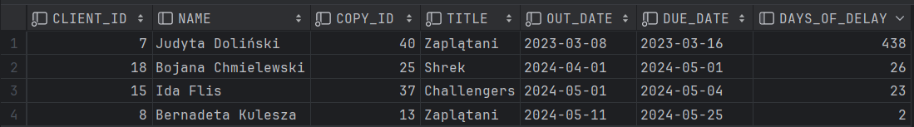
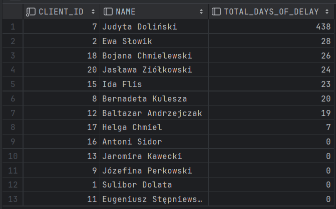

# **<p align="center">Wypożyczalnia filmów</p>**
#### **<p align="center">Zespół: Tomasz Furgała, Konrad Tendaj, Łukasz Zegar</p>**

<br>

### Aktorzy

1. Klient:
    - klient może założyć konto, które umożliwia mu korzystanie z systemu,
    - może składać rezerwacje na wybrany film,
    - przegląda listę filmów oferowanych przez wyporzyczalnie,
    - przeglądanie listy obecnie zarezrwonych i wypożyczonych przez niego filmów.

2. Pracownik:
    - rejestruje wypożycznie i zwracanie filmów w systemie,
    - dodawanie nowych filmów i kopii do systemu,
    - przegląda rezerawacje i wypożyczenia klientów,
    - może generować raporty.
    
3. Administrator
    - może edytować, dodawać, usuwać tabele,
    - może edytować, dodawać, usuwać dane w tabelach,
    - może generować raporty.

### Diagram bazy danych

<p align="center">
  
</p>

### Opis tabel

#### `Clients` - tabela zarejestrowanych klientów wypożyczalni
- client_id - id klienta (to samo co login_id),
- firstname - imię,
- lastname - nazwisko,
- address - adres,
- phone - numer telefonu.

```sql
CREATE TABLE Clients (
    client_id integer  NOT NULL,
    firstname varchar2(20)  NOT NULL,
    lastname varchar2(20)  NOT NULL,
    address_id integer  NOT NULL,
    phone varchar2(15)  NOT NULL,
    CONSTRAINT Clients_pk PRIMARY KEY (client_id)
);
```


---

#### `Reservation` - tabela z rezerwacjami filmów do przyszłego wypożyczenia
- reservation_id - id rezerwacji,
- copy_id - id egzemplarza filmu,
- client_id - id klienta,
- reservation_date - data rezerwacji,
- reservation_expiry_date - data wygaśnięcia rezerwacji,
- status - akutalny status rezerwacji,
    - `N` - nowa rezerwacja,
    - `C` - rezerwacja anulowana,
    - `R` - rezerwacaj zrealizowana.

```sql
CREATE TABLE Reservation (
    reservation_id integer  NOT NULL,
    copy_id integer  NOT NULL,
    client_id integer  NOT NULL,
    reservation_date date  NOT NULL,
    reservation_expiry_date date  NOT NULL,
    status char(1)  NOT NULL,
    CONSTRAINT Reservation_pk PRIMARY KEY (reservation_id)
);
ALTER TABLE Reservation ADD CONSTRAINT Reservation_Clients
    FOREIGN KEY (client_id)
    REFERENCES Clients (client_id);
ALTER TABLE Reservation ADD CONSTRAINT Reservation_Copy
    FOREIGN KEY (copy_id)
    REFERENCES Copy (copy_id);
```

---

#### `Rental` - tabela z informacjami o wypożyczeniach filmów przez klientów (aktualne oraz zwrócone)
- rental_id - id wypożyczenia,
- client_id - id klienta,
- copy_id - id wypożyczonego egzemplarza,
- out_date - data wypożyczenia filmu,
- due_date - okres, na który film został wypożyczony,
- return_date - data faktycznego zwrotu filmu (null jeśli nie zwrócony).

```sql
CREATE TABLE Rental (
    rental_id integer  NOT NULL,
    client_id integer  NOT NULL,
    copy_id integer  NOT NULL,
    out_date date  NOT NULL,
    due_date date  NOT NULL,
    return_date date NULL default NULL,
    CONSTRAINT Rental_pk PRIMARY KEY (rental_id)
);
ALTER TABLE Rental ADD CONSTRAINT Copy_Rental
    FOREIGN KEY (copy_id)
    REFERENCES Copy (copy_id);
ALTER TABLE Rental ADD CONSTRAINT Rental_Clients
    FOREIGN KEY (client_id)
    REFERENCES Clients (client_id);
```


---

#### `Copy` - tabela fizycznych kopii danego filmu
- copy_id - id danej kopii,
- movie_id - id jej filmu,
- is_available - czy wypożyczona lub zarezerwowana ("Y", jeśli jest dostępna, "N" jeśli nie).

```sql
CREATE TABLE Copy (
    copy_id integer  NOT NULL,
    movie_id integer  NOT NULL,
    is_available char(1)  NOT NULL,
    CONSTRAINT Copy_pk PRIMARY KEY (copy_id)
);
ALTER TABLE Copy ADD CONSTRAINT Copy_Movies
    FOREIGN KEY (movie_id)
    REFERENCES Movies (movie_id);
```


---

#### `Categories` - tabela kategorii filmów
- category_id - id kategorii,
- name - nazwa kategorii.
  
```sql
CREATE TABLE Categories (
    category_id int  NOT NULL,
    name varchar2(20)  NOT NULL,
    CONSTRAINT Categories_pk PRIMARY KEY (category_id)
);
```


---

#### `Movies` - tabela zawierająca informacje o filmach
- movie_id - id filmu,
- name - nazwa filmu,
- title - tytuł filmu,
- category_id - id głównej kategorii filmu,
- release_date - data globalna wydania filmu,
- duration - czas trwania filmu,
- rating - ocena filmu w skali 1 do 10,
- description - krótki opis filmu,
- production_country - kraj produkcji,
- director - imię i nazwisko reżysera.

```sql
CREATE TABLE Movies (
    movie_id int  NOT NULL,
    title varchar2(50) NOT NULL,
    category_id int  NOT NULL,
    release_date date  NOT NULL,
    duration timestamp  NOT NULL,
    rating int  NULL,
    description varchar2(100)  NULL,
    budget int  NULL,
    director varchar2(40)  NULL,
    CONSTRAINT Movies_pk PRIMARY KEY (movie_id)
);
ALTER TABLE Movies ADD CONSTRAINT Movies_Categories
    FOREIGN KEY (category_id)
    REFERENCES Categories (category_id);

```


---

#### `Actors` - tabela aktorów
- actor_id - id aktora,
- firstname - imię aktora,
- lastname - nazwisko aktora.

```sql
CREATE TABLE Actors (
    actor_id int  NOT NULL,
    firstname varchar2(20)  NOT NULL,
    lastname varchar2(20)  NOT NULL,
    CONSTRAINT Actors_pk PRIMARY KEY (actor_id)
);
```


---

#### `Actors_in_movie` - tabela łącząca aktora z filmem (do relacji wiele do wielu)
- movie_id - id filmu,
- actor_id - id aktora,
- role - rola aktora w filmie (jaką postać gra).

```sql
CREATE TABLE Actors_in_movie (
    movie_id int  NOT NULL,
    actor_id int  NOT NULL,
    role varchar2(20)  NOT NULL,
    CONSTRAINT Actors_in_movie_pk PRIMARY KEY (actor_id,movie_id)
);
ALTER TABLE Actors_in_movie ADD CONSTRAINT Actors_in_movie_Actors
    FOREIGN KEY (actor_id)
    REFERENCES Actors (actor_id);
ALTER TABLE Actors_in_movie ADD CONSTRAINT Actors_in_movie_Movies
    FOREIGN KEY (movie_id)
    REFERENCES Movies (movie_id);
```


---

### Widoki

#### `vw_available_copies`

Widok dostępnych kopii filmów wyświetla listę dostępnych kopii filmów wraz z ich szczegółami, takimi jak tytuł filmu, kategoria, data wydania, dostępność itp.

```sql
CREATE OR REPLACE VIEW vw_available_copies AS
SELECT
    c.copy_id,
    m.title AS movie_title,
    cat.name AS category_name,
    m.release_date,
    m.duration,
    c.is_available
FROM Copy c
JOIN Movies m ON c.movie_id = m.movie_id
JOIN Categories cat ON m.category_id = cat.category_id
WHERE c.is_available = 'Y';
```
```sql
select * from vw_available_copies;
```


---

#### `vw_currently_borrowed_copies`

Widok aktualnie wypożyczonych kopii z informacjami o kliencie, filmie oraz dniami opóźnienia lub 0 gdy nie minął termin zwrotu. Dane posortowane są w kolejności malejącej liczby dni opóźnienia zwrotu.

```sql
CREATE OR REPLACE VIEW vw_currently_borrowed_copies AS
    SELECT
        r.CLIENT_ID,
        cl.FIRSTNAME || ' ' || cl.LASTNAME AS Name,
        r.COPY_ID,
        m.TITLE,
        r.OUT_DATE,
        r.DUE_DATE,
        GREATEST(TRUNC(SYSDATE) - TRUNC(r.DUE_DATE), 0) AS Days_of_delay
    FROM
        RENTAL r
    JOIN
        COPY c ON c.COPY_ID = r.COPY_ID
    JOIN
        MOVIES m ON m.MOVIE_ID = c.MOVIE_ID
    JOIN
        CLIENTS cl ON cl.CLIENT_ID = r.CLIENT_ID
    WHERE
        RETURN_DATE IS NULL
    ORDER BY
        Days_of_delay DESC;
```
```sql
SELECT * FROM vw_currently_borrowed_copies;
```


---
#### `vw_current_reservations`

Widok rezerwacji aktualnych klientów pokazuje rezerwacje aktualnych klientów wraz z danymi klientów, filmami, na które zarezerwowali kopie, datami rezerwacji itp.

```sql
CREATE VIEW vw_current_reservations AS
SELECT r.reservation_id,
       c.client_id,
       c.firstname,
       c.lastname,
       m.title AS movie_title,
       r.reservation_date,
       r.reservation_expiry_date
FROM Reservation r
JOIN Clients c ON r.client_id = c.client_id
JOIN Copy co ON r.copy_id = co.copy_id
JOIN Movies m ON co.movie_id = m.movie_id
WHERE r.status = 'R';
```
```sql
select * from vw_current_reservations;
```


---

#### `vw_movie_popularity`
Widok pokazujący filmy od najpopularniejszego do najmniej popularnego względem sumarycznej liczby wypożyczeń jego kopii.

```sql
CREATE VIEW vw_movie_popularity AS
SELECT m.movie_id,
       m.title AS movie_title,
       COUNT(r.rental_id) AS num_rentals
FROM Movies m
LEFT JOIN Copy c ON m.movie_id = c.movie_id
LEFT JOIN Rental r ON c.copy_id = r.copy_id
GROUP BY m.movie_id, m.title
ORDER BY COUNT(r.rental_id) DESC;
```
```sql
select * from vw_movie_popularity;
```


---

#### `vw_clients_delays_sum`

Widok pokazujący klientów i ich sumę spóźnień w oddawaniu filmów względem aktualnie wypożyczonych oraz tych już oddanych z opóźnieniem. Wyniki posortowane są od tych klientów z największą liczbą dni.

```sql
CREATE OR REPLACE VIEW vw_clients_delays_sum AS
SELECT
    cl.CLIENT_ID,
    cl.FIRSTNAME || ' ' || cl.LASTNAME AS Name,
    SUM(
        CASE
            WHEN r.RETURN_DATE IS NULL THEN
                GREATEST(TRUNC(SYSDATE) - TRUNC(r.DUE_DATE), 0)
            ELSE
                GREATEST(TRUNC(r.RETURN_DATE) - TRUNC(r.DUE_DATE), 0)
        END
    ) AS Total_days_of_delay
FROM
    RENTAL r
JOIN
    CLIENTS cl ON cl.CLIENT_ID = r.CLIENT_ID
GROUP BY
    cl.CLIENT_ID,
    cl.FIRSTNAME,
    cl.LASTNAME
ORDER BY
    Total_days_of_delay DESC;
```
```sql
SELECT * FROM vw_clients_delays_sum;
```


---
#### `vw_actor_rentals`

Widok przedstawiający listę aktorów występujących w obecnie wypożyczonych filmach oraz liczbę filmów, w których każdy aktor wystąpił.

```sql
CREATE OR REPLACE VIEW vw_actor_rentals AS
SELECT a.actor_id,
       a.firstname,
       a.lastname,
       COUNT(*) AS num_movies
FROM Actors a
JOIN Actors_in_movie aim ON a.actor_id = aim.actor_id
JOIN Movies m ON aim.movie_id = m.movie_id
JOIN Copy c ON m.movie_id = c.movie_id
JOIN Rental r ON c.copy_id = r.copy_id
GROUP BY a.actor_id, a.firstname, a.lastname;
```
```sql
SELECT * FROM VW_ACTOR_RENTALS;
```


---

#### `vw_most_popular_actors_per_category`

Widok przedstawia najpopularniejszego aktora występującego w filmach danej kategorii. 

```sql
CREATE OR REPLACE VIEW vw_most_popular_actors_per_category AS
SELECT category_name,
       actor_name,
       movie_count
FROM (
    SELECT c.name AS category_name,
           a.firstname || ' ' || a.lastname AS actor_name,
           COUNT(*) AS movie_count,
           ROW_NUMBER() OVER (PARTITION BY c.category_id ORDER BY COUNT(*) DESC) AS actor_rank
    FROM Categories c
    JOIN Movies m ON c.category_id = m.category_id
    JOIN Actors_in_movie aim ON m.movie_id = aim.movie_id
    JOIN Actors a ON aim.actor_id = a.actor_id
    GROUP BY c.category_id, c.name, a.firstname, a.lastname
)
WHERE actor_rank = 1;
```
```sql
SELECT * FROM vw_most_popular_actors_per_category;
```


---

#### VW_MOVIES_WITH_CATEGORY

Widok wyświetla informacje o wszystkich filmach, które należą do wypożyczalni.

```sql
CREATE OR REPLACE VIEW vw_movies_with_category AS
SELECT
    c.name AS category_name,
    m.title AS movie_name,
    m.description AS movie_description,
    m.release_date,
    m.duration,
    m.rating,
    m.director
FROM Movies m
JOIN Categories c ON m.category_id = c.category_id;
```


---

### Funkcje

#### `f_get_client_reservations`

Funkcja ta umożliwia pobranie listy rezerwacji dla określonej osoby na podstawie jej identyfikatora klienta. Zwraca informacje o identyfikatorze rezerwacji, tytule filmu, dacie rezerwacji, dacie wygaśnięcia rezerwacji i statusie rezerwacji, co ułatwia zarządzanie rezerwacjami klientów w systemie wypożyczalni filmów.

```sql
CREATE OR REPLACE FUNCTION f_get_client_reservations(client_id_input INT)
RETURN SYS_REFCURSOR
IS
    is_person INT;
    reservation_cursor SYS_REFCURSOR;
BEGIN
    -- Sprawdzamy czy istnieje taka osoba w systemie
    SELECT count(*) INTO is_person FROM CLIENTS
    WHERE CLIENT_ID = client_id_input;
    IF is_person < 1
        THEN RAISE_APPLICATION_ERROR(-20000, 'Nie ma takiego użytkownika');
    END IF;

    OPEN reservation_cursor FOR
        SELECT r.reservation_id,
               m.title AS movie_title,
               r.reservation_date,
               r.reservation_expiry_date,
               r.status
        FROM Reservation r
        JOIN Copy c ON r.copy_id = c.copy_id
        JOIN Movies m ON c.movie_id = m.movie_id
        WHERE r.client_id = client_id_input;

    RETURN reservation_cursor;
END;
```
```sql
select f_get_client_reservations(1) from dual;
```

```sql
select f_get_client_reservations(73) from dual;
```


---

#### `f_is_copy_available`

Funkcja umożliwia sprawdzenie statusu konkretnej kopii filmu na podstawie jej identyfikatora. Zwraca informacje o tym, czy kopia jest aktualnie zarezerwowana, wypożyczona, dostępna, lub czy nie istnieje w bazie danych. Jest to przydatne narzędzie do zarządzania dostępnością kopii filmów w systemie wypożyczalni.

```sql
CREATE OR REPLACE FUNCTION f_is_copy_available(copy_id_input INT)
RETURN BOOLEAN
IS
    is_copy_anvailable CHAR(1);
BEGIN
    -- Sprawdzenie, czy kopia jest dostępna w tabeli Copy
    SELECT IS_AVAILABLE
    INTO is_copy_anvailable
    FROM Copy
    WHERE copy_id = copy_id_input;

    IF is_copy_anvailable = 'Y' THEN RETURN TRUE;
    ELSE RETURN FALSE;
    END IF;

EXCEPTION
    WHEN NO_DATA_FOUND THEN
        RETURN FALSE;
END;
```
```sql
BEGIN
    IF f_is_copy_available(1) THEN
        DBMS_OUTPUT.PUT_LINE('Copy is available.');
    ELSE
        raise_application_error(-20001, 'Copy is not available.');
    END IF;
END;
```


Gdy podamy copy_id = -1 to otrzymamy błąd:


---


#### `f_get_movies_by_category`

Funkcja zwraca filmy należące do określonej kategorii na podstawie przekazanego identyfikatora kategorii. Zestawienie zawiera nazwę kategorii, tytuł filmu, opis filmu, datę premiery, czas trwania, ocenę, i reżysera.

```sql
CREATE OR REPLACE FUNCTION f_get_movies_by_category(category_id_input INT)
RETURN SYS_REFCURSOR
IS
    is_category INT;
    movie_cursor SYS_REFCURSOR;
BEGIN
    -- Sprawdzamy czy istnieje taka kategoria
    SELECT count(*) INTO is_category FROM CATEGORIES
    WHERE CATEGORY_ID = category_id_input;
    IF is_category < 1
        THEN RAISE_APPLICATION_ERROR(-20000, 'Nie ma takiej kategorii');
    END IF;

    OPEN movie_cursor FOR
        SELECT
            c.name AS category_name,
            m.title AS movie_name,
            m.description AS movie_description,
            m.release_date,
            m.duration,
            m.rating,
            m.director
        FROM Movies m
        JOIN Categories c ON m.category_id = c.category_id
        WHERE c.category_id = category_id_input;

    RETURN movie_cursor;
END;
```

```sql
select f_get_movies_by_category(2) from dual;
```

```sql
select f_get_movies_by_category(123) from dual;
```


---

#### `f_check_client_exist`
Funkcja sprawdzająca czy dany client_id istnieje
```sql
CREATE OR REPLACE FUNCTION f_check_client_exist(client_id_input INT) 
RETURN BOOLEAN
IS
    client_count INT;
BEGIN
    -- Sprawdzenie, czy istnieje osoba o podanym ID w tabeli Clients
    SELECT COUNT(*)
    INTO client_count
    FROM Clients
    WHERE client_id = client_id_input;

    -- Jeśli liczba znalezionych rekordów jest większa od zera, to osoba istnieje
    IF client_count > 0 THEN
        RETURN TRUE;
    ELSE
        RETURN FALSE;
    END IF;
END;
```
```sql
BEGIN
    IF f_check_client_exist(-1) THEN
        DBMS_OUTPUT.PUT_LINE('Client exists.');
    ELSE
        raise_application_error(-20001, 'Client does not exist.');
    END IF;
END;
```


---

#### `f_check_copy_exist`

Funkcja sprawdza czy podany copy_id istnieje:
```sql
CREATE OR REPLACE FUNCTION f_check_copy_exist(copy_id_input INT) 
RETURN BOOLEAN
IS
    copy_count INT;
BEGIN
    SELECT COUNT(*)
    INTO copy_count
    FROM Copy
    WHERE copy_id = copy_id_input;

    -- Jeśli liczba znalezionych rekordów jest większa od zera, to kopia istnieje
    IF copy_count > 0 THEN
        RETURN TRUE;
    ELSE
        RETURN FALSE;
    END IF;
END;
```
```sql
BEGIN
    IF f_check_copy_exist(-1) THEN
        DBMS_OUTPUT.PUT_LINE('Copy exists.');
    ELSE
        raise_application_error(-20001, 'Copy does not exist.');
    END IF;
END;
```


---

#### `f_user_has_reservation`

Funkcja sprawdza czy podany użytkonik złożył wcześniej rezerwacje na dany film.

```sql
CREATE OR REPLACE FUNCTION f_user_has_reservation(
    user_id_input INT,
    copy_id_input INT
) RETURN BOOLEAN
IS
    v_count INT;
BEGIN
    SELECT COUNT(*)
    INTO v_count
    FROM Reservation
    WHERE CLIENT_ID = user_id_input
      AND copy_id = copy_id_input
      AND STATUS = 'N';

    RETURN v_count > 0;
EXCEPTION
    WHEN OTHERS THEN
        raise_application_error(-20001, 'Error checking reservation: ' || SQLERRM);
END;
```


```sql
BEGIN
    IF f_user_has_reservation(1, 1) THEN
        DBMS_OUTPUT.PUT_LINE('User has reservation.');
    ELSE
        raise_application_error(-20001, 'Reservation does not exist.');
    END IF;
END;
```

Przy wywołaniu tej funkcji nie pojawia się żaden błąd więc można wnioskować, że działa poprawnie.

---

#### `f_get_reservation_id`

Funkcja odpowiedzialna za pobranie `reservation_id` istniejącej rezerwacji z tabli `Reservation`.

```sql 
CREATE OR REPLACE FUNCTION f_get_reservation_id(
    user_id_input INT,
    copy_id_input INT
) RETURN INT
IS
    v_reservation_id INT;
BEGIN
    IF NOT F_USER_HAS_RESERVATION(user_id_input, copy_id_input) THEN
        raise_application_error(-20002, 'No such reservation.');
    END IF;

    SELECT reservation_id
    INTO v_reservation_id
    FROM Reservation
    WHERE CLIENT_ID = user_id_input
      AND COPY_ID = copy_id_input
      AND STATUS = 'N';

    RETURN v_reservation_id;
EXCEPTION
    WHEN NO_DATA_FOUND THEN
        raise_application_error(-20003, 'No matching reservation found.');
    WHEN OTHERS THEN
        raise_application_error(-20001, 'Error retrieving reservation_id: ' || SQLERRM);
END;
```
Użycie:


---

### Procedury

#### `p_add_reservation`

Procedura odpowiedzialna za dodanie nowej rezerwacji do tabeli `Reservations`.

```sql
CREATE OR REPLACE PROCEDURE p_add_reservation(
    client_id_input INT,
    copy_id_input INT,
    rental_duration_input INT
)
IS
    reservation_date_input DATE := SYSDATE;
    reservation_expiry_date_input DATE;
BEGIN
    -- Sprawdzenie, czy podana długość wypożyczenia jest większa niż 0
    IF rental_duration_input <= 0 THEN
        raise_application_error(-20001, 'Rental duration must be greater than 0.');
    END IF;

    -- Obliczenie daty wygaśnięcia rezerwacji poprzez dodanie liczby dni do daty rezerwacji
    reservation_expiry_date_input := reservation_date_input + rental_duration_input;
    
    -- Wstawianie nowej rezerwacji do tabeli Reservation
    INSERT INTO Reservation (client_id, copy_id, reservation_date, reservation_expiry_date, status)
    VALUES (client_id_input, copy_id_input, reservation_date_input, reservation_expiry_date_input, 'N');

    DBMS_OUTPUT.PUT_LINE('Reservation added successfully.');
EXCEPTION
    WHEN OTHERS THEN
        raise_application_error(-20002, 'Error adding reservation: ' || SQLERRM);
END;
```

Użycie:
```sql
BEGIN
    P_ADD_RESERVATION(1, 1, 10);
END;
```


---

#### `p_change_reservation_status`

Procedura odpowiedzialna za zmianę statusu rezerwacji. Jeżeli nowy status jest `C` (cancelled) to zmienia pole `is_available` w tabeli `Copy` na `Y`, w przeciwnym przypadku ustawia tą wartość na `N`.

```sql
CREATE OR REPLACE PROCEDURE p_change_reservation_status(
    reservation_id_input INT,
    new_status_input CHAR
)
IS
    reservation_exists INT;
BEGIN
    -- Sprawdzenie, czy podane reservation_id istnieje
    SELECT COUNT(*)
    INTO reservation_exists
    FROM Reservation
    WHERE reservation_id = reservation_id_input;

    IF reservation_exists = 0 THEN
        raise_application_error(-20001, 'Reservation with the given ID does not exist.');
    END IF;

    -- Aktualizacja statusu rezerwacji
    UPDATE Reservation
    SET status = new_status_input
    WHERE reservation_id = reservation_id_input;

    -- Aktualizacja stanu dostępności kopii w tabeli Copy
    IF new_status_input = 'C' THEN
        UPDATE Copy
        SET is_available = 'Y'
        WHERE copy_id IN (SELECT copy_id FROM Reservation WHERE reservation_id = reservation_id_input);
    ELSE
        UPDATE Copy
        SET is_available = 'N'
        WHERE copy_id IN (SELECT copy_id FROM Reservation WHERE reservation_id = reservation_id_input);
    END IF;

    DBMS_OUTPUT.PUT_LINE('Reservation status updated successfully.');
EXCEPTION
    WHEN OTHERS THEN
        raise_application_error(-20003, 'Error updating reservation status: ' || SQLERRM);
END;
```

I teraz spróbujemy anulować rezerwacje:
```sql
begin
    p_change_reservation_status(1,'C');
end;    
```
I zmiana w tabeli `Copy`:


---
#### `p_add_new_rental`

Procedura jest odpowiedzialna za dodawanie nowego wypożyczenia. Jeżeli użytkownik złożył wcześniej rezerwację to procedura zmienia status rezerwacji w tabeli `Reservation`. Jeśli użytkownik nie złożył rezerwacji to procedura zmienia status kopii na niedostępną w tabeli `Copy`.
    
```sql
CREATE OR REPLACE PROCEDURE p_add_new_rental(
    client_id_input INT,
    copy_id_input INT,
    rental_duration_input INT
)
IS
    reservation_date_input DATE := SYSDATE;
    reservation_expiry_date_input DATE;
    v_reservation_id INT;
BEGIN

    -- Sprawdzenie, czy podana długość wypożyczenia jest większa niż 0
    IF rental_duration_input <= 0 THEN
        raise_application_error(-20001, 'Rental duration must be greater than 0.');
    END IF;

    -- Obliczenie daty wygaśnięcia rezerwacji poprzez dodanie liczby dni do daty rezerwacji
    reservation_expiry_date_input := reservation_date_input + rental_duration_input;

    IF F_USER_HAS_RESERVATION(client_id_input, copy_id_input) THEN
        -- jeśli użytkownik złożył wcześniej rezerwacje to zmień status w tabeli Reservation
        v_reservation_id := F_GET_RESERVATION_ID(client_id_input, copy_id_input);
        P_CHANGE_RESERVATION_STATUS(v_reservation_id, 'R');
    ELSIF NOT F_IS_COPY_AVAILABLE(copy_id_input) THEN
        raise_application_error(-20002, 'Error: Cannot rent unavailable copy');
    ELSE
        -- jeśli użytkownik nie złożył wcześniej rezerwacji to zmień status w tabeli Copy
        UPDATE Copy
        SET is_available = 'N'
        WHERE copy_id = copy_id_input;
    END IF;


    -- Wstawienie nowego wypożyczenia do tabeli Rental
    INSERT INTO Rental (client_id, copy_id, out_date, due_date, return_date)
    VALUES (client_id_input, copy_id_input, reservation_date_input, reservation_expiry_date_input, null);

    DBMS_OUTPUT.PUT_LINE('New rental added successfully.');
EXCEPTION
    WHEN OTHERS THEN
        raise_application_error(-20003, 'Error adding new rental: ' || SQLERRM);
END;
```

Użycie:
Kopia o id = 2 jest dostępna:


po wykonaniu procedury:


--- 

#### `p_return_rental`

Procedura opowiedzialna za zwrot kopii i uzupełnienie pola `RETURN_DATE` w `Rental`. Odpowiada fizycznemu zwrotowi filmu do wypożyczalni.

```sql
create PROCEDURE P_RETURN_RENTAL (rental_id_input INT)
IS
    v_count INT;
BEGIN
    -- Sprawdzamy czy istnieje takie wypożyczenie
    SELECT COUNT(*) INTO v_count
    FROM Rental
    WHERE rental_id = rental_id_input;
    IF v_count = 0 THEN
        raise_application_error(-20002, 'Rental ID does not exist.');
    END IF;

    UPDATE RENTAL
    SET RETURN_DATE = SYSDATE
    WHERE RENTAL_ID = rental_id_input;

    DBMS_OUTPUT.PUT_LINE('Copy returned successfully.');

EXCEPTION
    WHEN OTHERS THEN
        raise_application_error(-20001, 'Error removing rental: ' || SQLERRM);
END;
```

Użycie: 
```sql
begin
    p_return_rental(21);
end;
```
Kopia o copy_id = 2 jest teraz dostępna:


I oczywiście uzupełniło się pole RETURN_DATE.

---

#### `p_process_rental`

Prodecura wywołująca procedurę odpowiedzialną za wypożyczenie 

```sql
CREATE OR REPLACE PROCEDURE p_process_rental (
    client_id_input INT,
    copy_id_input INT,
    rental_duration_input INT
)
IS
BEGIN
    -- Dodanie nowego wypożyczenia
    p_add_new_rental(client_id_input, copy_id_input, rental_duration_input);

    -- Zatwierdzenie zmian
    COMMIT;
EXCEPTION
    WHEN OTHERS THEN
        -- Wycofanie transakcji w przypadku błędu
        ROLLBACK;
END;
```
--- 

#### `p_process_reservation`

Tak jak poprzednio, procedura odpowiada w wywołanie procedury dodania nowej rezerwacji i zatwierdzenia zmian.

```sql
CREATE OR REPLACE PROCEDURE p_process_reservation (
    client_id_input INT,
    copy_id_input INT,
    rental_duration_input INT
)
IS
BEGIN
    -- Dodanie nowej rezerwacji
    P_ADD_RESERVATION(client_id_input, copy_id_input, rental_duration_input);

    -- Zatwierdzenie zmian
    COMMIT;
EXCEPTION
    WHEN OTHERS THEN
        -- Wycofanie transakcji w przypadku błędu
        ROLLBACK;
END;
```
---

#### `p_process_change_reservation_status`

Procedura odpowiada za wyłanie procedury do zmiany statusu rezerwacji i zatwierdzenia zmian. W przypadku błędu wywołuje komendą `Rollback`.
```sql
CREATE OR REPLACE PROCEDURE p_process_change_reservation_status (
    reservation_id_input INT,
    status_input Char
)
IS
BEGIN
    -- Zmiana statusu rezerwacji
    p_change_reservation_status(reservation_id_input, status_input);

    -- Zatwierdzenie zmian
    COMMIT;
EXCEPTION
    WHEN OTHERS THEN
        -- Wycofanie transakcji w przypadku błędu
        ROLLBACK;
END;
```
---

#### `p_process_rental_return`

Procedura odpowiada za wywołanie procedury do usuwania istniejących wypożyczeń i zatwierdzania zmian w bazie danych.

```sql
CREATE OR REPLACE PROCEDURE p_process_rental_return (
    rental_id_input INT
)
IS
BEGIN
    -- Zwrócenie kopii filmu
    p_return_rental(rental_id_input);

    -- Zatwierdzenie zmian
    COMMIT;
EXCEPTION
    WHEN OTHERS THEN
        -- Wycofanie transakcji w przypadku błędu
        ROLLBACK;
END;
```
---
#### `update_copy_availability`
Procedura odpowiedzialna za aktualizację pola `IS_AVAILABLE` w tabeli `Copy` w przypadku, gdy występują pewne nieprawidłowości. Sprawdzamy czy dana kopia jest zarezerwowana lub wypożyczona. Jeśli tak to poprawiamy pole na `Y`. Jeśli nie to ustawiamy na `N`.
```sql
CREATE OR REPLACE PROCEDURE update_copy_availability IS
BEGIN
    FOR copy_record IN (SELECT COPY_ID FROM COPY) LOOP
        DECLARE
            v_rental_count NUMBER;
            v_reservation_count NUMBER;
        BEGIN
            -- Sprawdzamy, czy kopia jest wypożyczona
            SELECT COUNT(*) INTO v_rental_count
            FROM RENTAL
            WHERE COPY_ID = copy_record.COPY_ID
              AND RETURN_DATE IS NULL;

            -- Sprawdzamy, czy kopia jest zarezerwowana
            SELECT COUNT(*) INTO v_reservation_count
            FROM RESERVATION
            WHERE STATUS = 'N' AND COPY_ID = copy_record.COPY_ID;

            -- Aktualizujemy dostępność kopii
            IF v_rental_count > 0 OR v_reservation_count > 0 THEN
                UPDATE COPY
                SET is_available = 'N'
                WHERE COPY_ID = copy_record.COPY_ID;
            ELSE
                UPDATE COPY
                SET is_available = 'Y'
                WHERE COPY_ID = copy_record.COPY_ID;
            END IF;
        END;
    END LOOP;

    COMMIT;
END;
```
W ten sposób można z niej skorzystać:
```sql
BEGIN
    update_copy_availability();
END;
```

---
### Triggery

#### `t_copy_check_available`

Triger sprawdza czy po zmianach w tabeli `Copy`, pole `is_available` ma wartość `N` albo `Y`.

```sql
CREATE OR REPLACE TRIGGER t_copy_check_available
BEFORE INSERT OR UPDATE OF is_available ON Copy
FOR EACH ROW
BEGIN
    IF :NEW.is_available NOT IN ('Y', 'N') THEN
        raise_application_error(-20001, 'Invalid value for is_available column. Value must be "Y" or "N".');
    END IF;
END;
```


---
#### `t_reservation_add`

Triger odpowiada za walidacje danych przy dodawaniu nowej rezerwacji oraz za zmianę statusu w tabeli `Copy`.

```sql
CREATE OR REPLACE TRIGGER t_reservation_add
BEFORE INSERT ON reservation
FOR EACH ROW
DECLARE
    copy_available BOOLEAN;
BEGIN
    IF NOT f_check_client_exist(:NEW.client_id) THEN
        raise_application_error(-20001, 'Client with the given ID does not exist.');
    END IF;

    IF NOT f_check_copy_exist(:NEW.copy_id) THEN
        raise_application_error(-20002, 'Copy with the given ID does not exist.');
    END IF;

    -- Wywołanie funkcji F_IS_COPY_AVAILABLE i przypisanie wyniku do zmiennej copy_available
    copy_available := f_is_copy_available(:NEW.copy_id);

    -- Sprawdzenie, czy kopia jest już zarezerwowana lub wypożyczona
    IF NOT copy_available THEN
        raise_application_error(-20003, 'Copy is already reserved or rented.');
    END IF;

    -- Sprawdzenie, czy status rezerwacji jest poprawny
    IF :NEW.status <> 'N' THEN
        raise_application_error(-20004, 'Invalid reservation status. Status must be "N".');
    END IF;

    -- Aktualizacja pola is_available na wartość 'N' w tabeli Copy
    UPDATE copy SET is_available = 'N' WHERE copy_id = :NEW.copy_id;
END;
```
Test trigera - na początku osoba o id=1 rezerwuje film o copy_id=1, a następnei osoba o id=2 próbuje zarezerwować ten sam film:
Pierwsza operacja - wszystko działa:
```sql
BEGIN
    P_ADD_RESERVATION(1, 1, 10);
END;
```
Drugie polecenie - pojawia się błąd:
```sql
BEGIN
    P_ADD_RESERVATION(2, 1, 10);
END;
```

---

#### `t_reservation_update`

Triger sprawdza czy nowy status skłąda się ze znaku `C`, `N` lub `R` oraz aktualizuje status w tabeli `Copy`.

```sql
CREATE OR REPLACE TRIGGER t_reservation_update
BEFORE UPDATE ON Reservation
FOR EACH ROW
DECLARE
    new_status_input CHAR(1);
BEGIN
    -- Przypisanie nowego statusu do zmiennej
    new_status_input := :NEW.status;

    -- Sprawdzenie, czy nowy status jest prawidłowy
    IF new_status_input NOT IN ('N', 'C', 'R') THEN
        raise_application_error(-20001, 'Invalid status. Status must be "N", "C", or "R".');
    END IF;

    -- Aktualizacja stanu dostępności kopii w tabeli Copy
    IF new_status_input = 'C' THEN
        UPDATE Copy
        SET is_available = 'Y'
        WHERE copy_id = :NEW.copy_id;
    ELSE
        UPDATE Copy
        SET is_available = 'N'
        WHERE copy_id = :NEW.copy_id;
    END IF;
END;
```


---
#### `t_rental_add`

Triger odpowiada za zmianę statusu kopii w tabeli `Copy` przy dodawaniu nowego wypożyczenia.

```sql
CREATE OR REPLACE TRIGGER t_rental_add
BEFORE INSERT ON Rental
FOR EACH ROW
BEGIN
    -- Aktualizacja stanu dostępności kopii w tabeli Copy
    UPDATE Copy
    SET is_available = 'N'
    WHERE copy_id = :NEW.copy_id;

    DBMS_OUTPUT.PUT_LINE('Rental added successfully.');
EXCEPTION
    WHEN OTHERS THEN
        raise_application_error(-20001, 'Error updating rental: ' || SQLERRM);
END;
```

---
#### `t_rental_return`

Triger odpowiada za zmianę statusu kopii w tabeli `Copy` przy zwracaniu wypożyczenia.

```sql
CREATE OR REPLACE TRIGGER t_rental_return
AFTER UPDATE ON Rental
FOR EACH ROW
BEGIN
    -- Sprawdamy czy zmiana dotyczyła zwrotu filmu
    IF :OLD.return_date IS NULL AND :NEW.return_date IS NOT NULL THEN
        -- Aktualizacja stanu dostępności kopii w tabeli Copy
        UPDATE Copy
        SET is_available = 'Y'
        WHERE copy_id = :OLD.copy_id;

        DBMS_OUTPUT.PUT_LINE('Rental returned successfully.');
    END IF;
EXCEPTION
    WHEN OTHERS THEN
        raise_application_error(-20001, 'Error returning rental: ' || SQLERRM);
END;

```
---
<br />

## **<p align="center">Backend</p>**

Aplikacja została zrealizowana w `Pythonie`, przy użyciu frameworka `Flask`.

#### Połączenie z bazą danych

W pliku `base.py` łączymy sie z bazą danych przy pomocy modułu `cx_Oracle`, który umożliwia interakcję z bazą danych `Oracle` za pomocą języka `Python`. 

```python
import cx_Oracle

global conn

def connect_to_data_base():
    global conn
    try:
        with open('MiniProjekt/backend/config.txt', 'r') as file:
            lines = file.readlines()

        config_data = {}

        for line in lines:
            key, value = line.strip().split(' = ')
            config_data[key] = value

        lib_dir = "C:\instantclient_21_13"
        user = config_data['user']
        password = config_data['password']
        dsn = cx_Oracle.makedsn("dbmanage.lab.ii.agh.edu.pl", 1521, sid="DBMANAGE")

        cx_Oracle.init_oracle_client(lib_dir=lib_dir)
        conn = cx_Oracle.connect(user=user, password=password, dsn=dsn, encoding="UTF-8")

        return conn

    except cx_Oracle.Error as error:
        print("Błąd podczas łączenia z bazą danych:", error)
        return None
```

### Wykonywanie poleceń:

Funkcja odpowiedzialna za wykonywanie poleceń w bazie danych.

```python
def execute_querry(sql):
    global conn
    try:
        cursor = conn.cursor()

        cursor.execute(sql)

        rows = cursor.fetchall()

        cursor.close()

        return rows

    except cx_Oracle.Error as error:
        print("Błąd podczas wykonania zapytania:", error)
        return {'error': str(error)}
```

### Główna aplikacja

```python
from flask import Flask
from base import connect_to_data_base
from views import views_blueprint

app = Flask(__name__)
app.config['JSON_AS_ASCII'] = False

conn = connect_to_data_base()
app.register_blueprint(views_blueprint)

if __name__ == '__main__':
    app.run(debug=True)

```